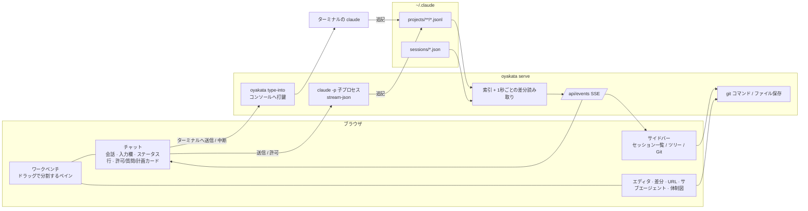

<div align="center">


# OYAKATA（親方）

**Claude Code のための、ブラウザ上の司令塔。**<br>
リポジトリをまたいで走るすべてのセッションを見渡し、出力を HTML で読み、指示を送り、変更を確かめて出荷する。全部ブラウザのタブ 1 枚で。

[](LICENSE)
[](https://www.rust-lang.org/)
[](#動作環境)
[](#2-oyakata-スキルを入れる)

[English](README.md) | **日本語**

</div>

---

## 目次

- [OYAKATA とは](#oyakata-とは)
- [できること](#できること)
- [クイックスタート](#クイックスタート)
- [インストール](#インストール)
- [使い方](#使い方)
  - [Claude Code の中から](#claude-code-の中から)
  - [ターミナルから](#ターミナルから)
  - [同じセッションをターミナルとブラウザの両方から使う](#同じセッションをターミナルとブラウザの両方から使う)
  - [ブラウザから話しかけられるセッション](#ブラウザから話しかけられるセッション)
  - [常駐を長く使うとき](#常駐を長く使うとき)
- [画面の案内](#画面の案内)
- [キーボードショートカット](#キーボードショートカット)
- [仕組み・プライバシー・安全性](#仕組みプライバシー安全性)
- [開発](#開発)
- [ライセンス](#ライセンス)

## OYAKATA とは

複数のリポジトリで Claude Code を同時に走らせ始めると、ターミナルだけでは追いきれなくなります。どのセッションが何をしているか分からない。表や図を含む長い回答が読みづらい。ツール呼び出しのログが会話を埋めてしまう。

OYAKATA は 1 つの Rust バイナリです。ローカルに小さなサーバーを立て、`~/.claude/projects` 配下の全セッションを索引化し、ブラウザの画面を開きます。そこでは次のことができます。

- **見る** — すべてのセッションをリポジトリ別に並べ、稼働中のものを上に固定し、状態を 1 秒ごとに更新する。
- **読む** — 出力を Markdown・Mermaid 図・シンタックスハイライト・表を含む HTML として描画する。
- **動かす** — 新しいセッションを始め、指示を送り（Claude が作業中でも）、権限の確認や質問に答え、計画を承認する。
- **出荷する** — リポジトリのファイル、差分、Git 操作を会話のすぐ隣で開く。

データはマシンの外に出ません。実行時の依存もありません。Claude Code の起動方法を変える必要もなく、閲覧は Claude Code が書き出すファイル（`projects/*/*.jsonl`、`sessions/*.json`）を読むだけです。

**名前について。** 親方（おやかた）は工房を束ねる人です。OYAKATA では、あなたが親方、メインの Claude が棟梁、サブエージェントが職人という見立てになっています。画面もそれに合わせて、承認には朱色の判子が押され、職人の仕事が終わると拍子木が鳴ります。

## できること

### 全体を一度に見渡す

- **全リポジトリをひとつの一覧に。** セッションは走っていたリポジトリの下にまとまり、稼働中のものは一番上に固定されます。
- **ライブの状態表示。** 各セッションに「作業中 / 待機中 / 判断待ち」が付き、1 秒ごとに更新されます。タブのアイコンにも点が付くので、別タブを見ていても気づけます。
- **マルチエージェントの体制図（👥）。** 親方（あなた）→ 棟梁（メインの Claude）→ 職人（サブエージェント）をライブで図示。同時に振られた仕事は「陣」にまとまり、各職人の役割・状態・いま実行中のツール・終わったときの報告が見えます。
- **コンテキストのメーター。** 直近の応答時点のトークン数 ÷ モデルのコンテキスト長をメーターで表示（65% で黄、85% で赤）。
- **通知。** 作業が終わる（busy → idle）と拍子木が「カン、カン」と鳴ります。終了や判断待ちをデスクトップ通知で受け取ることもできます（任意）。

### 目を細めずに読む

- **Markdown を描画。** ```` ```mermaid ```` は図に、コードはハイライト、表は表に。
- **長い回答でも迷わない。** 冒頭に目次、見出しごとに折り畳み、28 行を超えるコードは畳んで表示、スクロール中は読んでいる回答の元の質問を上部に固定、右端のレールでプロンプト間を移動。
- **作業ログは既定で非表示。** ツール呼び出し・思考・システムの差し込みは会話から消え、代わりに入力欄の上の 1 行で今何をしているかが分かります（`✻ 墨付け中… Bash: … (12秒 · esc で中断)`）。設定で全文表示に切り替えられます。
- **ファイル参照はクリックで開く。** 会話の中の `src/main.rs:42` をクリックするとエディタでその行に飛びます。

### ブラウザからセッションを動かす

- **ワンクリックで新しいセッション。** 「＋」でフォルダを選ぶだけ。空のチャットが開き、最初の指示を送った時点で Claude が起動します。権限モードは常に **auto** から始まります。
- **作業中でも送れる。** 送った指示は次のツール呼び出しの区切りで Claude に渡ります。ターミナルで作業中に打ち込むのと同じです。渡るまでは入力欄の上に「⏳ 次の区切りで渡します」と並び、Esc で中断しても捨てられません。
- **権限・質問・計画はチャットの中で。** 権限の確認、`AskUserQuestion`、計画の承認（`ExitPlanMode`）はカードとして表示され、その場で答えられます。許可・承認には朱色の「承認」、差し戻しには藍色の「差戻」の判子が押されます。
- **ターミナルと同じステータス行。** 入力欄の下に、左は権限モード（`⏵⏵ auto mode on`、Shift+Tab で切替）、右はモデル・努力レベル・コンテキスト使用率。実行中のセッションでもモードとモデルをその場で切り替えられます。
- **ターミナルのセッションにも話しかける（Windows）。** ターミナルで `claude` を直接起動したセッションには、「ターミナルへ送信」でそのターミナルに打ち込めます。終了後は「引き継ぎ」で OYAKATA の持ち物にでき、以降はブラウザから全部操作できます。

### 会話の隣にワークベンチ

- **ペインを自由に分割。** VS Code のようにタブをドラッグして左右上下に分割。チャット・エディタ・差分・URL・サブエージェント・体制図がすべてタブです。配置はリポジトリごとに記憶されます。
- **Claude が変えたファイルをその場で直す。** CodeMirror のエディタで編集・保存（Ctrl+S）。ディスク上で変わっていれば衝突を知らせ、Claude が開いているファイルを書き換えたら自動で読み直します。
- **ページを離れずに Git。** サイドバーに作業ツリーの変更、ログ、ブランチ。commit / push / pull は確認付きです。
- **付いてくるサイドバー。** セッション一覧 / ツリー / Git を切り替えるか、「並べて表示」で同時表示（境目はドラッグで調整）。セッションを選ぶとツリーと Git がそのリポジトリに切り替わります。
- **まだセッションの無いリポジトリも。** 「リポジトリ ＋追加」でローカルのフォルダを取り込むか、URL から `git clone`。ghq を使っていれば ghq と同じ配置に置かれます。

### コードを探す・追う

- **言語サーバー無しで定義と参照へ。** `F12` / `Ctrl+クリック` で定義へ、`Shift+F12` で参照一覧、`Alt+←` で戻る。候補は `git grep -P` と宣言の形（`fn` / `class` / `def` / `func` / `public …`）から集め、宣言らしさ・同じファイル・同じ拡張子・近いフォルダで順位付けします。
- **あいまい検索と全文検索。** `Ctrl+P` でファイル名（`file:line` で行も）、`Ctrl+Shift+F` でリポジトリの全文検索（大文字小文字・単語・正規表現・対象パス）か、すべての会話の横断検索。
- **深いパッケージを 1 行に。** 中身が 1 フォルダだけの階層は `src/main/java/jp/co/…` のようにまとめて表示（切替可）。開いたファイルはツリーで自動的に表示されます。

### 片付けと居心地

- **元に戻せるゴミ箱。** 一覧からセッションを削除すると記録は `~/.claude/oyakata-trash` へ移り、直後なら「元に戻す」、30 日で自動的に消えます。
- **テーマ。** ライト / ダーク / セピア / Solarized / Nord / Dracula / 高コントラスト、アクセント色、文字サイズ、本文の幅。

## クイックスタート

```bash
# 1. 本体を入れる（GitHub Releases のビルド済みバイナリ。Rust は不要）
curl -fsSL https://raw.githubusercontent.com/ShintaroOba/oyakata/main/scripts/install.sh | sh   # macOS / Linux
irm https://raw.githubusercontent.com/ShintaroOba/oyakata/main/scripts/install.ps1 | iex       # Windows (PowerShell)

# 2. /oyakata スキルを Claude Code のプラグインとして入れる
claude plugin marketplace add ShintaroOba/oyakata
claude plugin install oyakata@oyakata

# 3. 常駐を立ててブラウザを開く
oyakata
```

あとは Claude Code のセッションの中で `/oyakata` と打てば、そのセッションを開いた状態で司令塔が立ち上がります。以降、Claude は「ブラウザで読まれる」ことを知っているので、図は Mermaid で、比較は表で書くようになります。

## インストール

### 動作環境

| | |
| --- | --- |
| Rust | 不要。リリースごとにビルド済みバイナリを添付。ソースからビルドする場合のみ 1.80 以上 |
| Claude Code | `claude` コマンド（OYAKATA からセッションを起動するため） |
| git | ファイルツリー・差分・Git 操作のため |
| OS | Windows / macOS / Linux。ターミナルで稼働中のセッションへの打ち込みは Windows のみ |

### 1. 本体（`oyakata` コマンド）を入れる

Windows（x64 / arm64）、macOS（Intel / Apple Silicon）、Linux（x64 / arm64、静的リンク）のビルド済みバイナリを [GitHub Release](https://github.com/ShintaroOba/oyakata/releases) に添付しています。インストールスクリプトが環境に合うものを取り、SHA-256 を照合して PATH の通る場所に置きます。

```bash
# macOS / Linux: ~/.local/bin に置く
curl -fsSL https://raw.githubusercontent.com/ShintaroOba/oyakata/main/scripts/install.sh | sh
```

```powershell
# Windows: %LOCALAPPDATA%\Programs\oyakata に置き、ユーザーの PATH に加える
irm https://raw.githubusercontent.com/ShintaroOba/oyakata/main/scripts/install.ps1 | iex
```

この手順は飛ばしても構いません。Claude Code で初めて `/oyakata` と打ったとき、本体が無ければ Claude がプラグイン同梱の同じスクリプトを実行します。置き場所は `OYAKATA_INSTALL_DIR`、版は `OYAKATA_VERSION=v0.1.0` で指定できます。ダウンロードは `HTTPS_PROXY`（curl）/ システムのプロキシ設定（PowerShell）に従います。

Rust（1.80 以上）がある環境なら、ソースからビルドしても入ります。

```bash
cargo install --git https://github.com/ShintaroOba/oyakata
```

### 2. `/oyakata` スキルを入れる

スキルは、Claude に OYAKATA の起動方法と「ブラウザ向けの書き方」を教えるものです。プラグインとして入れると、マーケットプレイスの更新に追従します。

```bash
claude plugin marketplace add ShintaroOba/oyakata   # このリポジトリをマーケットプレイスとして登録
claude plugin install oyakata@oyakata               # /oyakata（正式には /oyakata:oyakata）
```

Claude Code の中なら `/plugin marketplace add ShintaroOba/oyakata` → `/plugin install oyakata@oyakata` でも同じです。

プラグインを使わない場合は、本体からスキルをコピーします。

```bash
oyakata install        # ~/.claude/skills/oyakata/SKILL.md を書き出す
```

### 3.（任意）全セッションで Mermaid を優先させる

すべての Claude Code セッションで図を Mermaid で描かせたい場合は、`~/.claude/CLAUDE.md` に次の 1 行を足してください（`oyakata install` でも案内されます）。

```
図は ```mermaid フェンスで書く（OYAKATA がブラウザで描画する）。ASCIIアートで図を描かない。
```

## 使い方

### Claude Code の中から

```
/oyakata
```

必要なら常駐を立ち上げ、今のセッションを開いた状態でブラウザが起動します。セッション ID を渡す（`/oyakata <session-id>`）とそのセッションが開きます。

### ターミナルから

| コマンド | 動作 |
| --- | --- |
| `oyakata` | 常駐を起動（既に動いていれば再利用）してブラウザを開く |
| `oyakata --focus <session-id>` | 同上。指定したセッションを開く |
| `oyakata --no-open` | ブラウザを開かずに常駐だけ起動 |
| `oyakata status` | 常駐が動いているか確認 |
| `oyakata stop` | 常駐を停止。OYAKATA が起動したセッションも終了するが、会話はディスクに残る |
| `oyakata serve` | フォアグラウンドで実行（ログを見たいとき） |
| `oyakata install` | `/oyakata` スキルを `~/.claude/skills/oyakata` にコピー |
| `oyakata new "最初の指示"` | このフォルダで OYAKATA が持つセッションを始め、この端末を接続する |
| `oyakata new --cwd <dir> "指示"` | フォルダを指定して同上。`--model`、`--mode`、`--effort`、`--no-attach` も指定できる |
| `oyakata attach <session-id>` | OYAKATA が持つセッションにこの端末を接続する |
| `oyakata attach --resume <session-id>` | 終了済みセッションを OYAKATA で再開する（最初の指示を聞かれる） |
| `oyakata sessions` | OYAKATA が今持っているセッションの一覧 |

共通オプション:

| オプション | 既定値 | 意味 |
| --- | --- | --- |
| `--port <n>` | `4848` | 待ち受けポート |
| `--bind <addr>` | `127.0.0.1` | バインドするアドレス |
| `--claude-dir <path>` | `$CLAUDE_CONFIG_DIR` または `~/.claude` | Claude Code の設定ディレクトリ |
| `--claude <path>` | `PATH` から探す | ブラウザから起動するセッションに使う `claude` の実行ファイル |
| `--repo-root <dir>` | | 直下のフォルダをリポジトリとして一覧に加える（複数指定可） |

常駐のログは `~/.claude/oyakata.log` に出ます。

### 同じセッションをターミナルとブラウザの両方から使う

OYAKATA が持つセッションは、ブラウザのチャットからもターミナルからも入力できます。どちらから打っても同じ会話に入り、権限の確認や質問にもどちらからでも答えられます。

```bash
oyakata new "パーサーをリファクタして"   # ここで始めて、この端末を接続
oyakata attach <session-id>            # 別の端末を接続（/quit で端末だけ離脱、/stop でセッション終了）
oyakata attach --resume <session-id>   # 終了済みセッションを引き継いで再開
```

権限モードは指定しなければ `auto` です。`--mode default|acceptEdits|plan|bypassPermissions` で変更できます。

### ブラウザから話しかけられるセッション

| セッション | ブラウザから |
| --- | --- |
| OYAKATA が起動したもの（ヘッダーやリポジトリの「＋」、`oyakata new`） | すべて操作できる。作業中でも送れて、次のツール呼び出しの区切りで渡る。権限の確認・質問もチャットで答える。Esc で中断、「⋯」→「セッションを終了」 |
| 終了済み | 送信すると OYAKATA が `claude --resume` で引き継ぎ、以後は上の行と同じ（権限モードは auto から） |
| ターミナルで稼働中（Windows） | 「ターミナルへ送信」でそのターミナルに打ち込んで Enter を押す。Esc で中断。確認待ちの間は送れない（Enter が既定の答えを選んでしまうため）。権限の確認はターミナル側で答える |
| IDE 拡張・SDK で稼働中 | 送れない（打ち込む先のターミナルが無いため）。終了後に引き継げる |

### 常駐を長く使うとき

常駐は Claude Code の中（`/oyakata`）からではなく、ターミナルで `oyakata` を実行して立ててください。Claude の中から立てた常駐は、その Claude セッションの終了に巻き込まれて止まることがあります。止まっても会話は残るので、ブラウザでそのセッションに送信する（OYAKATA が引き継ぐ）か `oyakata attach --resume <id>` で続けられます。

## 画面の案内



- **セッションをクリック**するとチャットが下のペインに開きます（VS Code のターミナルの位置）。同時にサイドバーのツリーと Git がそのリポジトリに切り替わります。
- **新しいセッション**はヘッダーの「＋」でフォルダを選ぶだけです。リポジトリの横の「＋」ならフォルダ選択も要りません。空のチャットが開き、最初の指示で Claude が起動します。
- **チャットの上部**は、状態の点・タイトル・リポジトリ名と、「👥 体制図」（サブエージェントがいるとき）・「⋯」メニュー（プロンプト一覧・変更したファイル・作業ログの表示切替・削除など）だけです。
- **入力欄の下のステータス行**はターミナルの Claude と同じ並びです。左が権限モード（クリックか Shift+Tab で切替）、右がモデル（クリックで切替）・努力レベル・コンテキスト使用率。
- **作業ログ**（ツール呼び出し・思考・システムの差し込み）は既定で会話から消しています。計画と Claude からの質問は会話に残ります。設定か「⋯」メニューで表示できます。
- **長い回答**には目次、見出しごとの折り畳み、28 行超のコードの折り畳み、スクロール中の質問の固定、右端のレールによるプロンプト間の移動が付きます。
- **ペインとタブ:** タブをドラッグして別のペインへ移す、またはペインの端に落として分割。サイドバーの行（セッション・ファイル・変更）もペインへ直接ドラッグできます。配置はブラウザに記憶され、設定の「ペイン配置を初期化」で戻せます。
- **サイドバーの大きさ:** 右端をドラッグで幅を変更（ダブルクリックで元に戻す）。「並べて表示」ではセッション・ツリー・検索・Git の境目をドラッグして高さを変えられます。
- **リポジトリごとの配置:** 別のリポジトリのセッションを選ぶと、ワークベンチ全体がそのリポジトリのタブに切り替わります。戻ると元のタブが未保存の編集ごとそのまま残っています。
- **ツリーの操作:** 「⫽」で 1 フォルダだけの階層をまとめる表示を切替、「⊟」ですべて折りたたみ。
- **判子と拍子木**は設定から止められます（「試しに鳴らす」で音を確認）。ブラウザの制約で、音はページを一度クリックするかキーを押した後から鳴ります。

<details>
<summary>ブラウザから動かすセッションの中身</summary>

OYAKATA が起動するセッションは次の子プロセスです。

```
claude -p --input-format stream-json --output-format stream-json --permission-prompt-tool stdio --permission-mode auto
```

会話は通常どおり `~/.claude/projects` に書かれるので、表示は他のセッションと同じ経路です。実行中の権限モードとモデルの切替は stream-json の `set_permission_mode` / `set_model` で送ります。作業中に送った指示はそのまま stdin に書き、Claude Code が次のツール呼び出しの区切りで読みます。`--replay-user-messages` を付けているので読まれた時点でエコーが返り、それまでは待機中として表示します。Esc で中断しても待機中の指示は捨てられず、次のターンとして読まれます。

</details>

## キーボードショートカット

VS Code に合わせています。設定の「ショートカット一覧」でも見られます。

| キー | 動作 |
| --- | --- |
| `Ctrl+P` | ファイルを開く（あいまい検索。`main.rs:42` で行も指定。`>` でコマンド、`:` で行、`@` でセッション） |
| `Ctrl+Shift+P` / `F1` | コマンドパレット |
| `Ctrl+Shift+F` | 全文検索（このリポジトリのファイル / すべての会話） |
| `Ctrl+F` / `F3` / `Shift+F3` | エディタ内を検索 / 次 / 前 |
| `Ctrl+G` | 行へ移動 |
| `F12` / `Ctrl+クリック` | 定義へ移動（候補が複数なら一覧から選ぶ） |
| `Shift+F12` | 参照を検索（検索ビューに一覧） |
| `Alt+←` / `Alt+→` | ジャンプ前の場所へ戻る / 進む |
| `Ctrl+Shift+E` / `Ctrl+Shift+G` | ツリー / Git を表示 |
| `Ctrl+B` | サイドバーの表示 / 非表示 |
| `` Ctrl+` `` | チャットの入力欄へ |
| `Ctrl+\` | アクティブなタブを右に分割 |
| `Ctrl+Alt+N` | 新しいセッション |
| `Ctrl+,` | 設定 |
| `Ctrl+S` | エディタで保存 |
| `Enter` / `Shift+Enter` | 入力欄で送信 / 改行 |
| `Shift+Tab` | 権限モードを切替（auto → default → acceptEdits → plan） |
| `Esc` | Claude が作業中なら中断。それ以外はメニュー・ダイアログを閉じる |
| `/` / `t` | セッション検索 / ライト・ダーク切替 |
| 中クリック | タブを閉じる |

`Ctrl+W`・`Ctrl+Tab`・`Ctrl+N` などはブラウザが先に使うため割り当てていません。

## 仕組み・プライバシー・安全性

- **索引。** `~/.claude/projects/<cwd>/<session>.jsonl` を起動時に 1 回読んでメタデータ（タイトル、cwd、往復数、トークン、直近のコンテキスト量、権限モード、編集ファイル、アーティファクト URL）を作り、以後はファイルサイズの増分だけを読み足します。本文をメモリに持つのは表示中のセッションだけで、15 分見ていないものは落とします。
- **コンテキスト使用率。** 直近の応答の `input + cache_creation + cache_read + output` トークンを、モデルのコンテキスト長で割った値です。OYAKATA が起動したセッションは Claude Code の報告値、それ以外はモデル名から推定します（Opus / Sonnet 4.6 以降・Fable は 1M、Haiku などは 200k）。
- **体制図。** `<session>/subagents/agent-*.jsonl` と `*.meta.json` を増分で読み、呼び出し元の Agent ツール呼び出しと突き合わせて、役割・状態・いまの作業を出します。
- **定義へのジャンプ。** `git grep -P` に宣言の形（`fn x` / `class X` / `def x` / `func (r T) X` / `public … x(` / `const x =` など）を並べたパターンを渡し、宣言らしさ・同じファイル・同じ拡張子・近いフォルダで順位付けします。参照は単語一致の `git grep -w` です。
- **検索。** ファイルは `git grep`（追跡中と、無視されていない未追跡のファイル）。会話は各セッションの JSONL を全コアで並列に読み、人と Claude の発言（ツールの出力は除く）だけを対象にします。
- **稼働中セッション。** `~/.claude/sessions/<pid>.json` が一覧です。pid が生きているものだけを「稼働中」と扱い、`status: waiting` は「判断待ち」として表示します。
- **ターミナルへの打ち込み（Windows）。** そのコンソールの入力バッファへキー入力を書き込みます（`AttachConsole` + `WriteConsoleInputW`）。Claude Code に外から入力を渡す公開手段が無いため、人が打つのと同じ経路を使っています。改行は Ctrl+J（Claude Code の「送らずに改行」）として打ち、送信前に確認を求められるゼロ幅文字などは先に取り除きます。打ち込む前に `sessions/<pid>.json` の `procStart` とプロセスの起動時刻を照合し、pid が別のプロセスに再利用されていたら打ちません。
- **リポジトリ。** cwd から `.git` を探して判定します。ghq 形式のパスは `owner/name` で表示し、`ghq root` 配下のリポジトリはセッションが無くても一覧に出ます。ブラウザから追加したフォルダは `~/.claude/oyakata.json` に記録します。
- **Git 操作**は `git` コマンドをそのまま呼びます。commit は選択したファイル（または `git add -A`）、push は上流が無ければ `-u origin HEAD`、pull は `--ff-only`、clone は `git clone --quiet -- <url> <dest>`（既存のフォルダには clone しない）です。ブランチ切替は意図的に入れていません。
- **Windows の PATH。** 常駐が痩せた環境変数で起動されても（ツールのサンドボックスなど）`git` や `node` が見つかるよう、レジストリのマシン / ユーザー `PATH` を補い、`git` は `OYAKATA_GIT` → `PATH` → Git for Windows の既定の場所の順で探します。
- **セッションの削除**は `~/.claude/oyakata-trash/<時刻>-<id>/` への移動です。OYAKATA が動かしているものは Claude を終了してから移し、ターミナルで動いているものは削除できません。30 日経ったものは次の起動時に消します。
- **ファイル保存**は読み込み時の更新時刻を添えて送り、ディスク上で変わっていれば 409 で止めて「上書き / 読み込み直す」を選ばせます。改行コードは元のファイルに合わせます。
- **ネットワーク。** サーバーは 127.0.0.1 だけで待ち受け、`/api` へのクロスサイト要求は `Sec-Fetch-Site` で拒否、書き込み系はカスタムヘッダ必須（CORS プリフライトで止まる）にしています。
- **描画**は [marked](https://github.com/markedjs/marked)・[DOMPurify](https://github.com/cure53/DOMPurify)・[highlight.js](https://highlightjs.org/)・[Mermaid](https://mermaid.js.org/)・[CodeMirror 5](https://codemirror.net/5/) をバイナリに同梱しています。オフラインで動きます。

## 開発

```bash
cargo test
cargo run -- serve --no-open
```

リリースは、`Cargo.toml` と `.claude-plugin/plugin.json` の `version` を同じ番号に上げてから `vX.Y.Z` のタグを push します。`.github/workflows/release.yml` が 6 つのターゲットをビルドして GitHub Release に添付し、インストールスクリプトはそこから取ります。

```bash
git tag v0.1.0 && git push origin v0.1.0
```

```
src/
  main.rs        CLI（起動・常駐・停止・スキル導入）
  server.rs      axum ルート、SSE、ファイル監視ループ、クロスサイト防御
  index.rs       セッション索引と増分更新、リポジトリ一覧
  transcript.rs  JSONL → 表示アイテム、編集ファイル・アーティファクトの抽出
  runner.rs      OYAKATA が起動する claude -p セッション（stream-json）
  console.rs     ターミナルで稼働中のセッションへの打鍵（Windows コンソール入力）
  client.rs      ターミナル側フロント（new / attach / sessions）
  gitops.rs      git status / tree / diff / log / grep / commit / push / pull / clone
  live.rs        稼働中セッション（pid 生存確認）
  paths.rs       PATH の補完と実行ファイルの探索
  repo.rs        cwd → リポジトリ名
web/
  index.html / style.css / icon.svg
  app.js         共通: API・テーマ・Markdown・トランスクリプト描画・イベントバス・設定
  workbench.js   ペインの分割ツリー、タブ、ドラッグ＆ドロップ、リポジトリごとの配置
  chat.js        チャットペイン（会話・ターミナル風の入力欄とステータス行・許可/質問/計画カード・進行表示）
  team.js        体制図（棟梁とサブエージェントの構成・状態）
  code.js        定義 / 参照へのジャンプ、戻る / 進む、会話中のファイル参照
  palette.js     Ctrl+P / コマンドパレット / 候補の選択
  search.js      全文検索ビュー（ファイル / 会話）
  fx.js          判子と拍子木
  editors.js     CodeMirror エディタ、差分・コミット・URL・サブエージェントのビュー
  sidebar.js     セッション一覧 / ツリー / Git（commit・push・pull）、削除、リポジトリ追加
  vendor/        同梱ライブラリ（marked, DOMPurify, highlight.js, Mermaid, CodeMirror 5）
skills/oyakata/  /oyakata スキル
scripts/         install.sh / install.ps1（GitHub Releases のビルド済みバイナリを入れる）
.claude-plugin/  プラグインとマーケットプレイスのマニフェスト
.github/workflows/release.yml  バージョンタグで 6 ターゲットをビルドして Release を公開
```

## ライセンス

MIT。同梱ライブラリのライセンスは `web/vendor/LICENSE.*` を参照してください。
