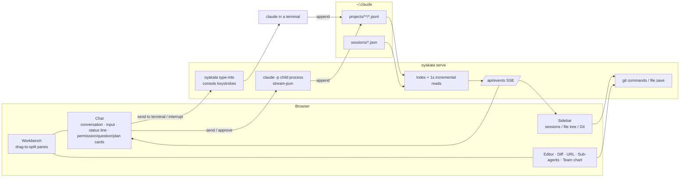

<div align="center">


# OYAKATA（親方）

**A browser-based command post for Claude Code.**<br>
See every session across every repository, read its output as rendered HTML, send it instructions, and ship the result, all from one tab.

[](LICENSE)
[](https://www.rust-lang.org/)
[](#requirements)
[](#2-install-the-oyakata-skill)

**English** | [日本語](README.ja.md)

</div>

---

> **Note**
> The browser UI is currently in Japanese. This README describes each control in English and gives the on-screen Japanese label in parentheses where it helps you find it.

## Table of contents

- [What is OYAKATA?](#what-is-oyakata)
- [Features](#features)
- [Quick start](#quick-start)
- [Installation](#installation)
- [Usage](#usage)
  - [From inside Claude Code](#from-inside-claude-code)
  - [From the terminal](#from-the-terminal)
  - [One session, two inputs: terminal and browser](#one-session-two-inputs-terminal-and-browser)
  - [Which sessions can you talk to from the browser?](#which-sessions-can-you-talk-to-from-the-browser)
  - [Running the daemon for a long time](#running-the-daemon-for-a-long-time)
- [A tour of the screen](#a-tour-of-the-screen)
- [Keyboard shortcuts](#keyboard-shortcuts)
- [How it works, privacy and safety](#how-it-works-privacy-and-safety)
- [Development](#development)
- [License](#license)

## What is OYAKATA?

When you run Claude Code in several repositories at once, the terminal stops being enough. You lose track of which session is doing what, long answers with tables and diagrams are hard to read, and tool-call logs bury the conversation.

OYAKATA is a single Rust binary that runs a small local server, indexes every session under `~/.claude/projects`, and opens a browser UI where you can:

- **See** all sessions grouped by repository, with running ones pinned on top and their status refreshed every second.
- **Read** their output as proper HTML: Markdown, Mermaid diagrams, syntax-highlighted code and tables.
- **Drive** them: start new sessions, send prompts (even while Claude is busy), answer permission prompts and questions, approve plans.
- **Ship** the result: open the repository's files, diffs and git operations right next to the conversation.

Nothing leaves your machine. There are no runtime dependencies. You do not need to change how you launch Claude Code; viewing only reads the files Claude Code already writes (`projects/*/*.jsonl`, `sessions/*.json`).

**About the name.** *Oyakata* (親方) is the master of a traditional Japanese workshop. In OYAKATA you are the *oyakata*, the main Claude session is the *tōryō* (棟梁, master builder), and sub-agents are the *shokunin* (職人, craftsmen). The UI leans into this: approvals get a vermilion *hanko* stamp, and a pair of wooden *hyōshigi* clappers sound when a worker finishes.

## Features

### See everything at once

- **One list for every repository.** Sessions are grouped under the repository they ran in. Running sessions are pinned at the top.
- **Live status.** Each session shows *working*, *idle*, or *waiting for your decision* (作業中 / 待機中 / 判断待ち), refreshed every second. The tab icon gets a dot too, so you notice from another tab.
- **Multi-agent team view (体制図).** A live chart of you → main Claude → sub-agents. Agents dispatched together are grouped into a squad (陣). Each craftsman shows its role, state, the tool it is running right now, and its report when done.
- **Context meter.** Token usage at the last response divided by the model's context window, shown as a meter (yellow at 65%, red at 85%).
- **Notifications.** Wooden clappers sound when a worker goes from busy to idle. Optional desktop notifications when a session finishes or waits for a decision.

### Read, don't squint

- **Rendered Markdown.** Fenced ```` ```mermaid ```` blocks become diagrams, code is highlighted, tables are tables.
- **Long answers stay navigable.** A table of contents at the top, collapsible sections per heading, code blocks over 28 lines folded by default, the question you are reading pinned to the top while you scroll, and a rail on the right edge to jump between prompts.
- **Work log hidden by default.** Tool calls, thinking and system injections disappear from the conversation. Instead, a single line above the input box tells you what Claude is doing right now (`✻ working… Bash: … (12s · esc to interrupt)`). Flip a setting to show the full log.
- **Clickable file references.** `src/main.rs:42` in a message opens that line in the editor.

### Drive sessions from the browser

- **Start a session with one click.** Press "＋", pick a folder, and an empty chat opens. Claude starts when you send the first message. Permission mode always starts as **auto**.
- **Send while Claude is busy.** Your prompt is handed over at the next tool-call boundary, exactly like typing into the terminal mid-task. Pending prompts are listed above the input box until they are delivered. Esc interrupts without dropping them.
- **Permissions, questions and plans in the chat.** Permission requests, `AskUserQuestion` prompts and plan approvals (`ExitPlanMode`) appear as cards you answer in place. Approvals get a vermilion 承認 stamp, rejections an indigo 差戻 stamp.
- **A status line like the terminal's.** Below the input: permission mode on the left (`⏵⏵ auto mode on`, cycle with Shift+Tab), model, effort level and context usage on the right. Switch mode and model on a running session.
- **Talk to terminal sessions too (Windows).** For sessions you started with `claude` in a terminal, "Send to terminal" (ターミナルへ送信) types your message into that console. When such a session ends, "Take over" (引き継ぎ) makes it an OYAKATA-owned session you can fully drive from the browser.

### A workbench next to the conversation

- **Split panes, your way.** Drag tabs to split the workbench left/right/up/down, like VS Code. Chat, editor, diff, URL, sub-agent and team-chart tabs all live in panes. Layouts are remembered per repository.
- **Edit what Claude changed.** A CodeMirror editor with save (Ctrl+S), conflict detection when the file changed on disk, and automatic reload when Claude rewrites the file you have open.
- **Git without leaving the page.** Working-tree changes, log and branches in the sidebar. Commit, push and pull with a confirmation step.
- **Sidebar that follows you.** Switch between sessions / file tree / Git, or show them side by side (並べて表示) with draggable dividers. Selecting a session switches the tree and Git view to its repository.
- **Repositories without sessions.** Add a local folder, or `git clone` from a URL. If you use `ghq`, clones land in the same layout.

### Find and navigate code

- **Go to definition and references without a language server.** `F12` / Ctrl+click jumps to the definition, `Shift+F12` lists references, `Alt+←` goes back. Candidates come from `git grep -P` and declaration shapes (`fn` / `class` / `def` / `func` / `public …`), ranked by likeness, same file, same extension and folder proximity.
- **Fuzzy file open and full-text search.** `Ctrl+P` for files (with `file:line`), `Ctrl+Shift+F` for repository-wide text search (case, whole word, regex, path filter) or for a search across all your conversations.
- **Compact deep packages.** Folder chains with a single child collapse to one line, so `src/main/java/jp/co/…` does not eat the tree. The file you open is revealed automatically.

### Housekeeping and comfort

- **Trash with undo.** Delete sessions from the list. Records move to `~/.claude/oyakata-trash`, can be restored right away, and are purged after 30 days.
- **Themes.** Light, dark, sepia, Solarized, Nord, Dracula and high contrast, plus accent color, font size and content width.

## Quick start

```bash
# 1. Install the binary (needs Rust 1.80+)
cargo install --git https://github.com/ShintaroOba/oyakata

# 2. Install the /oyakata skill as a Claude Code plugin
claude plugin marketplace add ShintaroOba/oyakata
claude plugin install oyakata@oyakata

# 3. Start the daemon and open the browser
oyakata
```

Then, inside any Claude Code session, type `/oyakata` to open the command post focused on that session. From then on, Claude writes diagrams as Mermaid and comparisons as tables, because it knows it is being read in a browser.

## Installation

### Requirements

| | |
| --- | --- |
| Rust | 1.80 or newer (for `cargo install`) |
| Claude Code | The `claude` CLI, for sessions started from OYAKATA |
| git | For the file tree, diffs and git operations |
| OS | Windows, macOS, Linux. Typing into a terminal-run session is Windows only. |

### 1. Install the `oyakata` binary

```bash
cargo install --git https://github.com/ShintaroOba/oyakata
```

### 2. Install the `/oyakata` skill

The skill tells Claude how to launch OYAKATA and how to write for a browser. Installing it as a plugin keeps it updated with the marketplace.

```bash
claude plugin marketplace add ShintaroOba/oyakata   # register this repository as a marketplace
claude plugin install oyakata@oyakata               # provides /oyakata (formally /oyakata:oyakata)
```

Inside Claude Code the equivalent is `/plugin marketplace add ShintaroOba/oyakata` followed by `/plugin install oyakata@oyakata`.

If you prefer not to use plugins, copy the skill from the binary instead:

```bash
oyakata install        # writes ~/.claude/skills/oyakata/SKILL.md
```

### 3. (Optional) Prefer Mermaid in every session

To make every Claude Code session draw diagrams as Mermaid, add this line to `~/.claude/CLAUDE.md` (`oyakata install` reminds you too):

```
図は ```mermaid フェンスで書く（OYAKATA がブラウザで描画する）。ASCIIアートで図を描かない。
```

## Usage

### From inside Claude Code

```
/oyakata
```

This starts the daemon if needed and opens the browser on the current session. If you pass a session id (`/oyakata <session-id>`), that session opens instead.

### From the terminal

| Command | What it does |
| --- | --- |
| `oyakata` | Start the daemon (or reuse the running one) and open the browser |
| `oyakata --focus <session-id>` | Same, but open a specific session |
| `oyakata --no-open` | Start the daemon without opening a browser |
| `oyakata status` | Show whether a daemon is running |
| `oyakata stop` | Stop the daemon. Sessions OYAKATA started are ended too, but their conversations stay on disk |
| `oyakata serve` | Run the server in the foreground (handy for watching logs) |
| `oyakata install` | Copy the `/oyakata` skill into `~/.claude/skills/oyakata` |
| `oyakata new "first prompt"` | Start an OYAKATA-owned session in the current folder and attach this terminal to it |
| `oyakata new --cwd <dir> "prompt"` | Same, in another folder. Also `--model`, `--mode`, `--effort`, `--no-attach` |
| `oyakata attach <session-id>` | Attach this terminal to an OYAKATA-owned session |
| `oyakata attach --resume <session-id>` | Resume an ended session under OYAKATA (asks for the first prompt) |
| `oyakata sessions` | List the sessions OYAKATA owns right now |

Global options:

| Option | Default | Meaning |
| --- | --- | --- |
| `--port <n>` | `4848` | Port to listen on |
| `--bind <addr>` | `127.0.0.1` | Address to bind |
| `--claude-dir <path>` | `$CLAUDE_CONFIG_DIR` or `~/.claude` | Claude Code config directory |
| `--claude <path>` | found on `PATH` | The `claude` executable used for sessions started from the browser |
| `--repo-root <dir>` | | Extra folder whose direct subfolders are listed as repositories (repeatable) |

The daemon writes its log to `~/.claude/oyakata.log`.

### One session, two inputs: terminal and browser

A session OYAKATA owns accepts input from both the browser chat and a terminal. Whatever you type on either side goes into the same conversation, and permission prompts and questions can be answered from either.

```bash
oyakata new "Refactor the parser"       # start here, attached to this terminal
oyakata attach <session-id>             # attach another terminal (/quit detaches, /stop ends the session)
oyakata attach --resume <session-id>    # pick up an ended session
```

Permission mode defaults to `auto`; pass `--mode default|acceptEdits|plan|bypassPermissions` to change it.

### Which sessions can you talk to from the browser?

| Session | From the browser |
| --- | --- |
| Started by OYAKATA ("＋" in the header or next to a repository, `oyakata new`) | Full control. Send anytime, even mid-task (delivered at the next tool-call boundary). Answer permissions and questions in the chat. Esc interrupts, "⋯" → end session |
| Ended | Sending a message makes OYAKATA resume it with `claude --resume`; from then on it behaves like the row above (permission mode starts as auto) |
| Running in a terminal (Windows) | "Send to terminal" types into that console and presses Enter. Esc interrupts. You cannot send while it waits for a confirmation (Enter would pick the default answer). Answer permissions in the terminal |
| Running in an IDE extension or the SDK | No input (there is no console to type into). Can be taken over after it ends |

### Running the daemon for a long time

Start the daemon from a terminal (`oyakata`), not from inside Claude Code. A daemon started by `/oyakata` can be taken down when that Claude session exits. If that happens, nothing is lost: send a message to the session in the browser (OYAKATA resumes it) or run `oyakata attach --resume <id>`.

## A tour of the screen



- **Click a session** and its chat opens in the bottom pane (where VS Code puts the terminal). The sidebar's tree and Git view switch to that repository.
- **New session:** "＋" in the header, pick a folder. The "＋" next to a repository skips the folder picker. An empty chat opens; Claude starts on your first message.
- **Chat header:** status dot, title, repository, the team chart button (👥 体制図, shown when sub-agents exist) and a "⋯" menu (prompt list, changed files, toggle work log, delete, and so on).
- **Status line under the input:** permission mode on the left (click or Shift+Tab to cycle), model (click to switch), effort and context usage on the right.
- **Work log** (tool calls, thinking, system injections) is hidden by default. Plans and Claude's questions stay in the conversation. Toggle in settings or the "⋯" menu.
- **Long answers** get a table of contents, collapsible headings, folded code over 28 lines, a pinned question while scrolling, and a right-edge rail to jump between prompts.
- **Panes and tabs:** drag a tab into another pane, or onto a pane's edge to split. Sidebar rows (sessions, files, changes) can be dragged straight into a pane. Layouts persist in the browser; "Reset pane layout" in settings restores the default.
- **Sidebar sizing:** drag the right edge to resize (double-click to reset). In side-by-side mode, drag the dividers between sessions, tree, search and Git.
- **Per-repository layouts:** switching to a session in another repository swaps the whole workbench to that repository's tabs. Switch back and your tabs are as you left them, including unsaved edits.
- **Tree controls:** "⫽" toggles collapsing single-child folder chains, "⊟" collapses everything.
- **Stamps and clappers** can be turned off in settings ("Test sound" previews the clappers). Browsers only allow audio after you click or press a key on the page once.

<details>
<summary>How browser-driven sessions run</summary>

Sessions OYAKATA starts are child processes of:

```
claude -p --input-format stream-json --output-format stream-json --permission-prompt-tool stdio --permission-mode auto
```

The conversation is written to `~/.claude/projects` as usual, so it is displayed through the same path as every other session. Switching permission mode and model on a running session uses stream-json `set_permission_mode` / `set_model`. Prompts sent mid-task are written to stdin as-is, and Claude Code reads them at the next tool-call boundary. `--replay-user-messages` echoes each prompt back once it is read, so OYAKATA can show it as pending until then. Esc interrupts the current turn but keeps pending prompts; they become the next turn.

</details>

## Keyboard shortcuts

Shortcuts follow VS Code. The full list is also in settings ("Shortcuts").

| Key | Action |
| --- | --- |
| `Ctrl+P` | Open file (fuzzy; `main.rs:42` jumps to a line; `>` commands, `:` line, `@` sessions) |
| `Ctrl+Shift+P` / `F1` | Command palette |
| `Ctrl+Shift+F` | Full-text search (this repository's files / all conversations) |
| `Ctrl+F` / `F3` / `Shift+F3` | Find in editor / next / previous |
| `Ctrl+G` | Go to line |
| `F12` / Ctrl+click | Go to definition (pick from a list if there are several) |
| `Shift+F12` | Find references (listed in the search view) |
| `Alt+←` / `Alt+→` | Back / forward through jump history |
| `Ctrl+Shift+E` / `Ctrl+Shift+G` | Show file tree / Git |
| `Ctrl+B` | Toggle sidebar |
| `` Ctrl+` `` | Focus the chat input |
| `Ctrl+\` | Split the active tab to the right |
| `Ctrl+Alt+N` | New session |
| `Ctrl+,` | Settings |
| `Ctrl+S` | Save in editor |
| `Enter` / `Shift+Enter` | Send / newline in the input |
| `Shift+Tab` | Cycle permission mode (auto → default → acceptEdits → plan) |
| `Esc` | Interrupt Claude if it is working; otherwise close menus and dialogs |
| `/` / `t` | Search sessions / toggle light and dark |
| Middle click | Close tab |

`Ctrl+W`, `Ctrl+Tab`, `Ctrl+N` and similar are left to the browser.

## How it works, privacy and safety

- **Indexing.** `~/.claude/projects/<cwd>/<session>.jsonl` is read once at startup to build metadata (title, cwd, turn count, tokens, last context size, permission mode, edited files, artifact URLs). After that only the appended bytes are read. Only the session on screen keeps its body in memory; sessions not viewed for 15 minutes are dropped.
- **Context meter.** `input + cache_creation + cache_read + output` tokens of the last response, divided by the model's context window. For OYAKATA-started sessions the window comes from Claude Code; otherwise it is inferred from the model name (Opus / Sonnet 4.6 and later and Fable: 1M, Haiku and others: 200k).
- **Team chart.** Reads `<session>/subagents/agent-*.jsonl` and `*.meta.json` incrementally and matches them to the parent's Agent tool calls to derive role, state and current work.
- **Go to definition.** Runs `git grep -P` with a pattern built from declaration shapes (`fn x`, `class X`, `def x`, `func (r T) X`, `public … x(`, `const x =`, …) and ranks by declaration likeness, same file, same extension and folder distance. References use word-match `git grep -w`.
- **Search.** Files via `git grep` (tracked plus non-ignored untracked). Conversations by reading each session's JSONL in parallel on all cores, matching only human and Claude messages (tool output excluded).
- **Live sessions.** `~/.claude/sessions/<pid>.json` lists running sessions. Only entries whose pid is alive count as running; `status: waiting` is shown as "waiting for decision".
- **Typing into terminals (Windows).** Keystrokes are written to the console input buffer (`AttachConsole` + `WriteConsoleInputW`), because Claude Code has no public way to accept external input. Newlines are sent as Ctrl+J (Claude Code's "newline without sending"), and zero-width characters that would trigger a confirmation are stripped first. Before typing, `procStart` in `sessions/<pid>.json` is checked against the process start time, so a reused pid is never typed into.
- **Repositories.** Detected by walking up from cwd to a `.git`. ghq-style paths are shown as `owner/name`, and repositories under `ghq root` are listed even without sessions. Folders added from the browser are stored in `~/.claude/oyakata.json`.
- **Git operations** call the `git` CLI directly. Commit uses the selected files (or `git add -A`); push adds `-u origin HEAD` when there is no upstream; pull is `--ff-only`; clone is `git clone --quiet -- <url> <dest>` and refuses existing folders. Branch switching is intentionally absent.
- **PATH on Windows.** So that `git` and `node` are found even when the daemon inherits a stripped environment (tool sandboxes), the machine and user `PATH` from the registry are added, and `git` is looked up as `OYAKATA_GIT` → `PATH` → the default Git for Windows location.
- **Deleting sessions** moves them to `~/.claude/oyakata-trash/<time>-<id>/`. OYAKATA-run sessions are stopped first; terminal-run sessions cannot be deleted. Items older than 30 days are purged at the next start.
- **Saving files** sends the modification time seen at load. If the file changed on disk, the server answers 409 and the UI offers "overwrite / reload". Line endings follow the original file.
- **Network.** The server listens on 127.0.0.1 only, rejects cross-site requests to `/api` via `Sec-Fetch-Site`, and requires a custom header on mutating calls so CORS preflight blocks them.
- **Rendering** uses [marked](https://github.com/markedjs/marked), [DOMPurify](https://github.com/cure53/DOMPurify), [highlight.js](https://highlightjs.org/), [Mermaid](https://mermaid.js.org/) and [CodeMirror 5](https://codemirror.net/5/), all bundled into the binary. It works offline.

## Development

```bash
cargo test
cargo run -- serve --no-open
```

```
src/
  main.rs        CLI (start, daemon, stop, skill install)
  server.rs      axum routes, SSE, file-watch loop, cross-site protection
  index.rs       session index with incremental updates, repository list
  transcript.rs  JSONL → display items, edited files and artifact extraction
  runner.rs      claude -p sessions started by OYAKATA (stream-json)
  console.rs     typing into terminal-run sessions (Windows console input)
  client.rs      terminal front end (new / attach / sessions)
  gitops.rs      git status / tree / diff / log / grep / commit / push / pull / clone
  live.rs        running sessions (pid liveness)
  paths.rs       PATH augmentation and executable lookup
  repo.rs        cwd → repository name
web/
  index.html / style.css / icon.svg
  app.js         shared: API, themes, Markdown, transcript rendering, event bus, settings
  workbench.js   pane split tree, tabs, drag and drop, per-repository layouts
  chat.js        chat pane (conversation, terminal-style input and status line, permission/question/plan cards, progress)
  team.js        team chart (main Claude and sub-agents)
  code.js        go to definition / references, back / forward, file references in messages
  palette.js     Ctrl+P / command palette / pickers
  search.js      full-text search view (files / conversations)
  fx.js          hanko stamps and hyōshigi clappers
  editors.js     CodeMirror editor, diff / commit / URL / sub-agent views
  sidebar.js     sessions / tree / Git (commit, push, pull), delete, add repository
  vendor/        bundled libraries (marked, DOMPurify, highlight.js, Mermaid, CodeMirror 5)
skills/oyakata/  the /oyakata skill
.claude-plugin/  plugin and marketplace manifests
```

## License

MIT. Bundled libraries keep their own licenses; see `web/vendor/LICENSE.*`.
