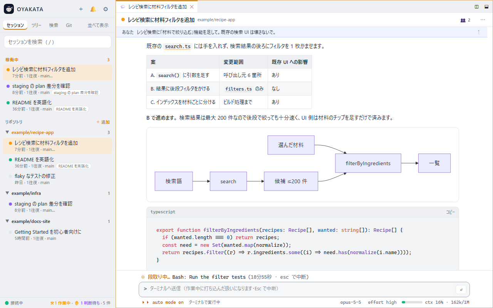
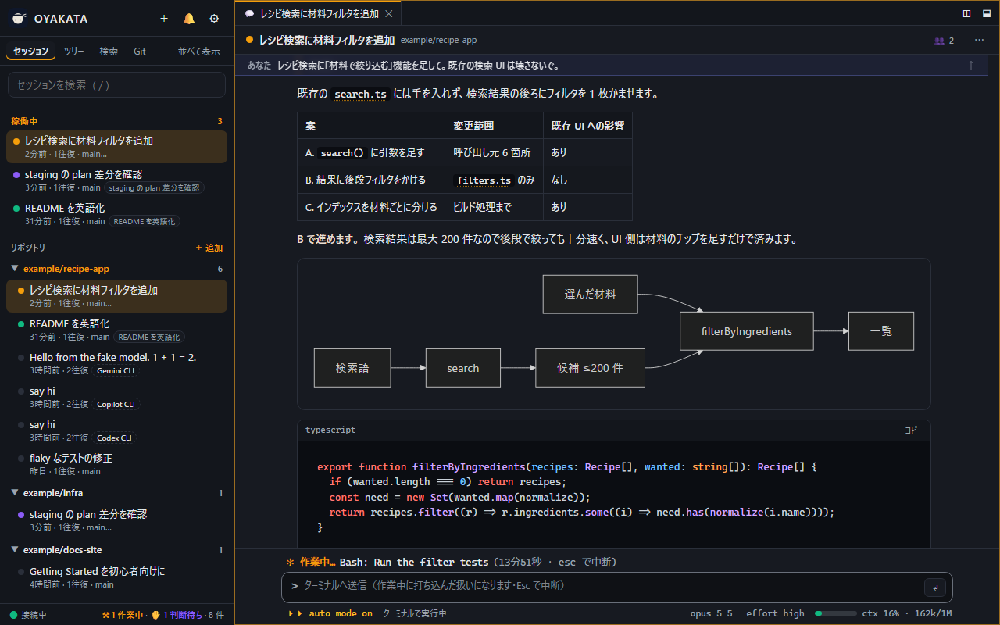
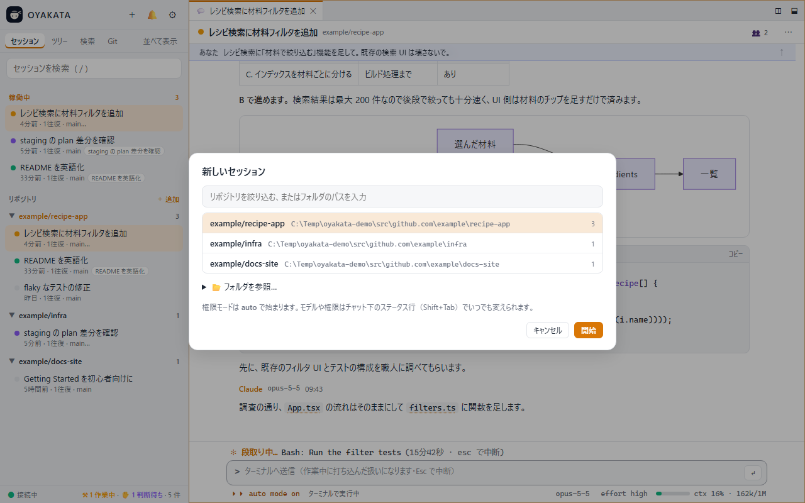
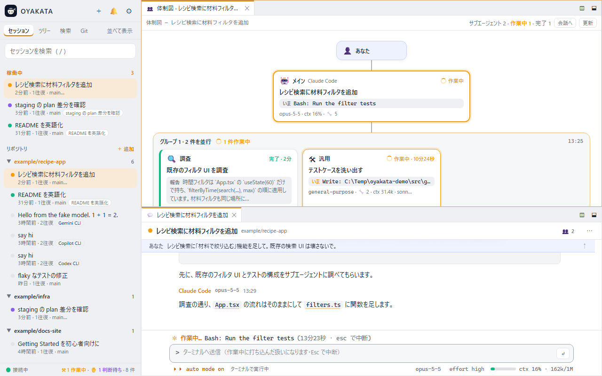
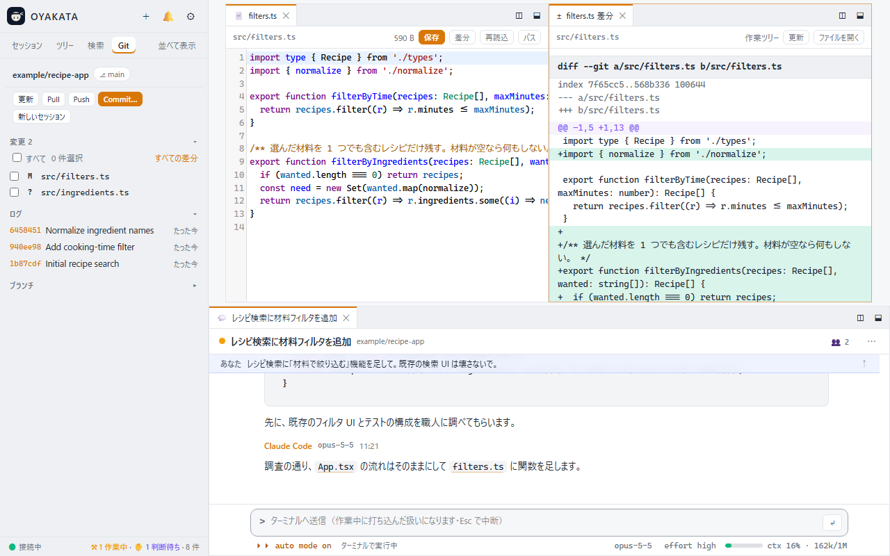

<div align="center">


# OYAKATA（親方）

**Watch and direct your coding-agent sessions from the browser.**

OYAKATA gathers the sessions that Claude Code, Codex CLI, Gemini CLI, Copilot CLI and OpenCode are running across your repositories into one screen, renders their output properly, and lets you send instructions right there. The UI comes in English and Japanese.

[](LICENSE)
[](#from-the-terminal)
[](#get-started-with-the-skill)

**English** | [日本語](README.ja.md)

</div>



> **Note** The screenshots show the Japanese UI; pick English on first launch (or in Settings) and every label is in English.

## What is it?

Once you run two or three coding agents in parallel, the terminal stops being enough.

- You lose track of which terminal is doing what.
- Long answers with tables and diagrams are hard to read in a terminal.
- Tool-call logs bury the conversation.

OYAKATA solves this in a single browser tab. It reads the records each agent already keeps on your machine (`~/.claude` for Claude Code, `~/.codex` for Codex CLI, and so on), so you do not change how you launch or use the agents. Everything stays on your machine; nothing is sent anywhere.

| | What you can do |
| --- | --- |
| **See** | Every session of every agent in every repository, in one list. Running ones are pinned on top, with their state (working / idle / waiting for your decision) refreshed every second |
| **Read** | Markdown, tables, code and diagrams rendered as HTML. Long answers get a table of contents and collapsible sections |
| **Direct** | Send instructions from the browser. With Claude Code, answer permission prompts and questions in place too |
| **Ship** | Open the files the agent changed in an editor next to the chat, check the diff, and commit / push |

## Supported agents

| Agent | Sessions are read from | Started and driven from the browser with |
| --- | --- | --- |
| **Claude Code** | `~/.claude/projects` | `claude -p`. Prompts can be sent mid-turn; permission prompts, questions and plan approvals are answered in the browser |
| **Codex CLI** (OpenAI) | `~/.codex/sessions` | `codex exec` / `codex exec resume`. One prompt is one turn |
| **Gemini CLI** (Google) | `~/.gemini/tmp/*/chats` | `gemini --output-format stream-json`. One prompt is one turn |
| **Copilot CLI** (GitHub) | `~/.copilot/session-state` | `copilot --output-format json`. One prompt is one turn |
| **OpenCode** | its database, through `opencode db` | `opencode run`. One prompt is one turn |

Installed agents are detected automatically (a data folder or a command on `PATH` is enough), and each can be hidden in Settings. Agents other than Claude Code run non-interactively, one turn per prompt, so there are no permission cards for them; instead the permission mode on the status line is mapped to each CLI's sandbox / approval flags:

| Permission mode | Codex CLI | Gemini CLI | Copilot CLI | OpenCode |
| --- | --- | --- | --- | --- |
| auto (default) | `sandbox_mode=workspace-write` | `--approval-mode yolo` | `--allow-all-tools` | `--auto` |
| acceptEdits | `workspace-write` | `auto_edit` | `--allow-all-tools` | `--auto` |
| default | `workspace-write` | `default` | (tools not allowed) | (permissions not granted) |
| plan | `read-only` | `plan` | (tools not allowed) | `--agent plan` |

A session that is currently running in another process (a terminal, for example) is shown read-only as "running in another process" until it finishes.

## Get started with the skill

OYAKATA ships as an agent skill. Install the skill, ask your agent to open OYAKATA, and the agent does the rest. No Rust toolchain needed.

**1. Install the skill**

In Claude Code, add it as a plugin:

```
/plugin marketplace add ShintaroOba/oyakata
/plugin install oyakata@oyakata
```

From a terminal: `claude plugin marketplace add ShintaroOba/oyakata`, then `claude plugin install oyakata@oyakata`.

For Codex CLI, Gemini CLI, Copilot CLI and OpenCode, [install the binary](#install-the-binary) and run `oyakata install` once. It puts the same SKILL.md in the shared `~/.agents/skills` folder these agents read, and in `~/.claude/skills` for Claude Code.

**2. Ask for it**

```
/oyakata
```

In Claude Code, type `/oyakata`. In any agent, phrases like "open oyakata", "show this in the browser" or "what are the other agents doing?" trigger the skill too.

If the `oyakata` binary is missing, the agent installs a prebuilt one from [GitHub Releases](https://github.com/ShintaroOba/oyakata/releases) with the install script (Windows / macOS / Linux). It then starts the background daemon and opens the browser. On the first visit the browser asks which language you want (English / Japanese).

From then on, the agent in that session knows it is being read in a browser: it writes comparisons as tables and diagrams in a renderable form (Mermaid).

## A tour of the screen

### Sessions and the conversation



- **The sidebar** lists running sessions at the top and each repository's history below. The dot shows the state: orange is working, green is idle, purple is waiting for your decision. Sessions of agents other than Claude Code carry a label such as "Codex CLI", and sessions working in a worktree show their branch after ⎇. The counts appear at the bottom of the sidebar too ("1 working · 1 waiting").
- **Click a session** to open its conversation. The work log (tool calls and so on) is hidden; the single line above the input tells you what the agent is doing right now (`Bash: Run the filter tests … esc to interrupt`). A setting shows the full log.
- **Under the input** is a status line like the terminal's: permission mode on the left (cycle with Shift+Tab), model, effort level and context usage on the right. For agents other than Claude Code, changes apply from the next turn.

### Starting a new session



Press "＋" in the header, pick an agent and a folder. An empty chat opens, and the agent starts when you send the first message. Permission mode starts as auto.

In a Git repository, each new session works in its own worktree by default. OYAKATA creates a branch `oyakata/<name>` from the current commit, checks it out under `~/.oyakata/worktrees/<repository>/<name>`, and starts the agent there. Sessions running side by side on one repository therefore never edit each other's files or your own checkout. The session is still listed under its repository, and the file tree, diffs and Git view show the worktree. To work in the folder itself, click the ⎇ button on the status line before the first message, or turn worktrees off for every session in Settings. When you are done, end the session and pick "Remove worktree" from the chat's ⋯ menu. The folder is deleted, and the branch is deleted too if it has been merged.

With Claude Code you can send while it is busy: the prompt is handed over at the next tool-call boundary, and until then it is listed above the input as pending. Permission requests, `AskUserQuestion` prompts and plan approvals appear as cards in the chat that you answer in place. Approvals get a vermilion "承認" (approved) stamp, rejections an indigo "差戻" (sent back) stamp. With the other agents, a prompt sent while a turn runs becomes the next turn once the current one ends.

### Team chart (sub-agents)



Press "👥" at the top right of the chat to see the main agent and its sub-agents: who is working on what, which tool each is running right now, and what each reported when done. Sub-agents dispatched together are grouped, and the chart updates live.

### Files, diffs and Git



Next to the conversation you can open the files the agent edited in an editor (Ctrl+S saves), read the diff, and commit / push / pull from the Git view in the sidebar. Panes split by dragging tabs, like VS Code, and the layout is remembered per repository.

More things it does:

- `Ctrl+P` fuzzy-opens files; `Ctrl+Shift+F` searches the repository's text or all your conversations
- `F12` / Ctrl+click goes to a definition and `Shift+F12` lists references, with no language server required
- A file reference like `src/main.rs:42` in a message opens that line in the editor
- Markdown files switch between "Preview" (rendered) and "Text" (editable)
- A short sound plays when an agent finishes a turn. Optional desktop notifications when a session goes idle or waits for a decision
- Themes: light, dark, sepia, Solarized, Nord, Dracula and high contrast, plus accent color, font size and content width
- Delete sessions you no longer need. Records move to a trash folder (`~/.oyakata/trash`) and are purged after 30 days (OpenCode sessions live in a database and are deleted in place)

### Language

The browser asks for English or Japanese on the first visit; change it later under Settings (⚙) → "言語 / Language". The choice is stored in `~/.oyakata/config.json`, and the terminal side (`oyakata new`, `oyakata attach`, …) follows it. `OYAKATA_LANG=ja|en` overrides it for one command.

## From the terminal

OYAKATA also works as a plain command, without the skill. It is a single binary with no runtime dependencies.

### Install the binary

Prebuilt binaries (Windows x64 / arm64, macOS Intel / Apple Silicon, Linux x64 / arm64) are attached to every [GitHub Release](https://github.com/ShintaroOba/oyakata/releases). The install script downloads the one for your machine, verifies its SHA-256 and puts it on your PATH.

```bash
# macOS / Linux: installs to ~/.local/bin
curl -fsSL https://raw.githubusercontent.com/ShintaroOba/oyakata/main/scripts/install.sh | sh
```

```powershell
# Windows: installs to %LOCALAPPDATA%\Programs\oyakata and adds it to your user PATH
irm https://raw.githubusercontent.com/ShintaroOba/oyakata/main/scripts/install.ps1 | iex
```

`OYAKATA_INSTALL_DIR` changes the location and `OYAKATA_VERSION=v0.2.0` pins a release. With a Rust toolchain (1.80+), `cargo install --git https://github.com/ShintaroOba/oyakata` works too.

You also need:

| | |
| --- | --- |
| The CLIs of the agents you want to drive | `claude`, `codex`, `gemini`, `copilot`, `opencode`: whichever you want to start from the browser. Viewing needs none of them |
| git | For the file tree, diffs and Git operations |

### Start and stop

```bash
oyakata                     # start the daemon (or reuse the running one) and open the browser
oyakata --focus <session>   # same, opening a specific session
oyakata status              # is a daemon running?
oyakata stop                # stop it (sessions OYAKATA started end too; their conversations stay on disk)
oyakata install             # copy the /oyakata skill into each agent's skills folder
```

If you keep the daemon around for a long time, start it from a terminal (`oyakata`) rather than from inside an agent session (`/oyakata`). A daemon started inside a session can be taken down when that session exits. Nothing is lost if that happens: send a message to the session in the browser and OYAKATA resumes it.

<details>
<summary>More commands and options</summary>

| Command | What it does |
| --- | --- |
| `oyakata --no-open` | Start the daemon without opening a browser |
| `oyakata serve` | Run the server in the foreground (handy for watching logs) |
| `oyakata new "first prompt"` | Start an OYAKATA-owned session in the current folder and attach this terminal to it. In a Git repository it runs in a new worktree; `--no-worktree` works in the folder itself. `--agent codex` picks the agent; also `--cwd <dir>`, `--model`, `--mode`, `--effort`, `--no-attach` |
| `oyakata attach <session-id>` | Attach this terminal to an OYAKATA-owned session (`/quit` detaches, `/stop` ends the session) |
| `oyakata attach --resume <session-id>` | Resume an ended session under OYAKATA |
| `oyakata sessions` | List the sessions OYAKATA owns right now |

| Option | Default | Meaning |
| --- | --- | --- |
| `--port <n>` | `4848` | Port to listen on |
| `--bind <addr>` | `127.0.0.1` | Address to bind |
| `--claude-dir <path>` | `$CLAUDE_CONFIG_DIR` or `~/.claude` | Claude Code config directory |
| `--claude <path>` | found on `PATH` | The `claude` executable used for sessions started from the browser |
| `--repo-root <dir>` | | Extra folder whose direct subfolders are listed as repositories (repeatable) |

The other agents are found automatically; override their locations with their own variables (`CODEX_HOME`, `COPILOT_HOME`), point at a command with `OYAKATA_<AGENT>` (for example `OYAKATA_CODEX`), or edit `agents` in `~/.oyakata/config.json`. The daemon writes its log to `~/.oyakata/oyakata.log`.

A session OYAKATA owns accepts input from both the browser chat and a terminal. Whatever you type on either side goes into the same conversation, and permission prompts and questions can be answered from either.

```bash
oyakata new "Refactor the parser"                 # start with Claude Code, attached to this terminal
oyakata new --agent codex "Fix the failing test"  # start with Codex CLI
oyakata attach <session-id>                       # join the same conversation from another terminal
```

</details>

## FAQ

**Which sessions can I talk to from the browser?**

| Session | From the browser |
| --- | --- |
| Started by OYAKATA ("＋" or `oyakata new`) | Full control. Claude Code takes prompts mid-task and answers permissions and questions in the chat; the other agents take the next prompt as the next turn |
| Ended | Sending a message makes OYAKATA resume it with that agent; from then on it behaves like the row above |
| Claude Code running in a terminal (Windows) | "Send to terminal" (ターミナルへ送信) types into that console and presses Enter. Answer permissions in the terminal |
| Another agent running in another process | Read-only until it finishes |
| Running in an IDE extension or the SDK | No input (there is no console to type into). It can be taken over after it ends |

**Where does my data go?**

Nowhere. The server listens on `127.0.0.1` only, and viewing just reads the files the agents write (for Claude Code, `~/.claude/projects/*/*.jsonl` and `~/.claude/sessions/*.json`). Only OpenCode is read through its `opencode db` command. The rendering libraries (marked, DOMPurify, highlight.js, Mermaid, CodeMirror) are bundled into the binary, so it works offline.

**Do I need to change my agents' settings?**

No. Optionally, to make every session draw diagrams as Mermaid, add a line like this to the agent's global instructions (`~/.claude/CLAUDE.md` for Claude Code, `~/.codex/AGENTS.md` for Codex CLI, `~/.gemini/GEMINI.md` for Gemini CLI):

```
Write diagrams in ```mermaid fences (OYAKATA renders them in the browser). Do not draw diagrams as ASCII art.
```

<details>
<summary>Keyboard shortcuts</summary>

Shortcuts follow VS Code. The full list is also in settings ("Shortcuts").

| Key | Action |
| --- | --- |
| `Ctrl+P` | Open file (fuzzy; `main.rs:42` jumps to a line; `>` commands, `:` line, `@` sessions) |
| `Ctrl+Shift+P` / `F1` | Command palette |
| `Ctrl+Shift+F` | Full-text search (this repository's files / all conversations) |
| `Ctrl+F` / `F3` / `Shift+F3` | Find in editor / next / previous |
| `Ctrl+G` | Go to line |
| `F12` / Ctrl+click | Go to definition (pick from a list if there are several) |
| `Shift+F12` | Find references (listed in the search view) |
| `Alt+←` / `Alt+→` | Back / forward through jump history |
| `Ctrl+Shift+E` / `Ctrl+Shift+G` | Show file tree / Git |
| `Ctrl+B` | Toggle sidebar |
| `` Ctrl+` `` | Focus the chat input |
| `Ctrl+\` | Split the active tab to the right |
| `Ctrl+Alt+N` | New session |
| `Ctrl+,` | Settings |
| `Ctrl+S` | Save in editor |
| `Enter` / `Shift+Enter` | Send / newline in the input |
| `Shift+Tab` | Cycle permission mode (auto → default → acceptEdits → plan) |
| `Esc` | Interrupt the agent if it is working; otherwise close menus and dialogs |
| `/` / `t` | Search sessions / toggle light and dark |
| Middle click | Close tab |

`Ctrl+W`, `Ctrl+Tab`, `Ctrl+N` and similar are left to the browser.

</details>

<details>
<summary>How it works and safety</summary>

- **Indexing.** Claude Code's `~/.claude/projects/<cwd>/<session>.jsonl` is read once at startup to build metadata (title, cwd, turn count, tokens, permission mode, edited files and so on). After that only the appended bytes are read. Only the session on screen keeps its body in memory.
- **Other agents.** Codex CLI (rollout JSONL) and Copilot CLI (events.jsonl) are read incrementally, Gemini CLI (a JSONL whose earlier records can change) is re-read whole, and OpenCode comes through `opencode db`; each is converted into the same line shape Claude Code writes and fed to the same index. The converters live in `src/agents/` and are tested against real session captures in `tests/fixtures/`.
- **Running sessions.** For Claude Code, `~/.claude/sessions/<pid>.json` lists them; only entries whose pid is alive count as running, and `status: waiting` is shown as "waiting for decision". The other agents keep no such registry, so a session whose file changed within the last 20 seconds is shown as "running in another process".
- **Context meter.** The last response's tokens (input + cache + output) divided by the model's context window. For OYAKATA-started Claude Code sessions the window comes from Claude Code; otherwise it is inferred from the model name.
- **Team chart.** Reads `<session>/subagents/agent-*.jsonl` and `*.meta.json` and matches them to the parent's Agent tool calls (Claude Code).
- **Browser-started sessions.** Claude Code is a child process of `claude -p --input-format stream-json --output-format stream-json --permission-prompt-tool stdio`: prompts go in on stdin and permission requests come back on stdout. The other agents are started once per prompt (`codex exec`, `gemini`, `copilot`, `opencode run`) with the prompt on stdin; their JSON event stream drives the status line, and the next prompt resumes the same session. Every agent writes its own transcript, so display goes through the same path as any other session.
- **Worktrees.** A new session runs `git worktree add -b oyakata/<name> <folder> HEAD` in the repository it was started from. The name comes from the first words of an English prompt, or from the time otherwise. A worktree's `.git` file points back at the main repository, so its sessions are listed there. "Remove worktree" runs `git worktree remove` and then `git branch -d`, which keeps a branch that has not been merged.
- **Typing into terminals (Windows)** writes keystrokes to that console's input buffer (`AttachConsole` + `WriteConsoleInputW`). The process start time is checked first, so a reused pid is never typed into.
- **Git operations** call the `git` CLI directly. Commit uses the selected files; push adds `-u origin HEAD` when there is no upstream; pull is `--ff-only`. Branch switching is intentionally absent.
- **Go to definition and search** use `git grep`. No language server is involved.
- **Saving files** sends the modification time seen at load. If the file changed on disk, the UI stops and offers "overwrite / reload".
- **Network.** Cross-site requests to `/api` are rejected via `Sec-Fetch-Site`, and mutating calls require a custom header.

</details>

## Development

```bash
cargo test
cargo run -- serve --no-open
```

UI strings are written in Japanese and English comes from a dictionary. After adding strings, run `python docs/i18n/transform.py` to wrap them in `t()` and collect the keys, add English to `docs/i18n/en.json`, and run `python docs/i18n/build.py` to generate `web/i18n-en.js` (it reports untranslated keys). Rust-side messages use `i18n::tr(ja, en)`.

To release, bump `version` in `Cargo.toml` and `.claude-plugin/plugin.json` to the same number and push a `vX.Y.Z` tag. `.github/workflows/release.yml` builds six targets and attaches the archives to a GitHub Release, which is where the install scripts download from.

```bash
git tag v0.2.0 && git push origin v0.2.0
```

```
src/
  main.rs        CLI (start, daemon, stop, skill install)
  server.rs      axum routes, SSE, file-watch loop, the OpenCode import loop, cross-site protection
  index.rs       session index with incremental updates, repository list, config and trash
  agents/        per-agent discovery, conversion and launch commands (codex / gemini / copilot / opencode) plus the shared line builders (canon)
  transcript.rs  JSONL → display items, edited files and artifact extraction
  runner.rs      sessions OYAKATA starts (Claude Code over stream-json, the others one turn per process)
  i18n.rs        language of the terminal output
  console.rs     typing into terminal-run sessions (Windows console input)
  client.rs      terminal front end (new / attach / sessions)
  gitops.rs      git status / tree / diff / log / grep / commit / push / pull / clone / worktree
  live.rs        running sessions (pid liveness)
  paths.rs       PATH augmentation, executable lookup and the ~/.oyakata folder
  repo.rs        cwd → repository name (a worktree maps to its main repository)
web/
  index.html / style.css / icon.svg
  i18n.js / i18n-en.js  language switch and the English dictionary (generated from docs/i18n)
  app.js         shared: API, themes, Markdown, transcript rendering, event bus, settings, language choice
  workbench.js   pane split tree, tabs, drag and drop, per-repository layouts
  chat.js        chat pane (conversation, terminal-style input and status line, permission/question/plan cards, progress)
  team.js        team chart (main agent and sub-agents)
  code.js        go to definition / references, back / forward, file references in messages
  palette.js     Ctrl+P / command palette / pickers
  search.js      full-text search view (files / conversations)
  fx.js          approval stamps and the completion sound
  editors.js     CodeMirror editor, diff / commit / URL / sub-agent views
  sidebar.js     sessions / tree / Git (commit, push, pull), delete, add repository
  vendor/        bundled libraries (marked, DOMPurify, highlight.js, Mermaid, CodeMirror 5)
skills/oyakata/  the /oyakata skill (the Claude Code plugin, and the SKILL.md that oyakata install gives the other agents)
scripts/         install.sh / install.ps1 (download a prebuilt binary from GitHub Releases)
tests/fixtures/  real session captures of each agent, with personal data removed
docs/i18n/       UI string keys, the English dictionary and the build scripts
docs/images/     README screenshots (taken with dummy sessions and repositories)
.claude-plugin/  plugin and marketplace manifests
.github/workflows/release.yml  builds six targets on a version tag and publishes the release
```

## License

MIT. Bundled libraries keep their own licenses; see `web/vendor/LICENSE.*`.
