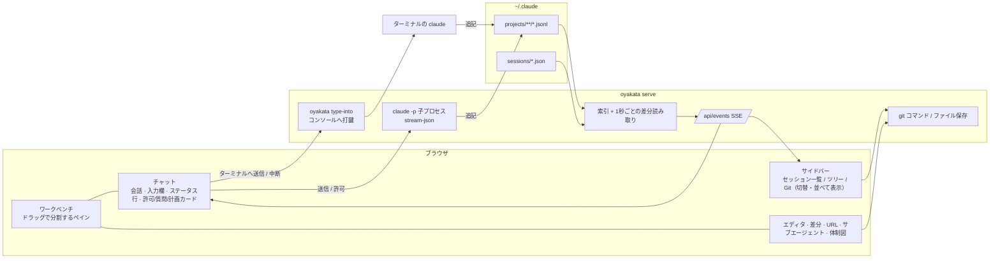

# OYAKATA（親方）

リポジトリをまたいで走っている Claude Code のセッションを、ブラウザ 1 枚で見渡し、指示を送り、変更を確かめて出荷するための司令塔です。

> A browser-based command post for Claude Code. It indexes every session under `~/.claude/projects`, groups them by repository, shows which ones are running right now, renders their output as proper HTML (Markdown, Mermaid diagrams, syntax-highlighted code), lets you start and drive sessions from the browser, and opens the repository's files, diffs and git operations next to the conversation. Single Rust binary, no runtime dependencies, nothing leaves your machine.

## できること

| 課題 | OYAKATA |
| --- | --- |
| 複数リポジトリで Claude を並行で動かすと、どれが何をしているか追えない | 稼働中セッションを上に固定し、セッションのあるリポジトリの配下に履歴を並べる。作業中 / 待機中 / 判断待ち を 1 秒ごとに更新。タブのアイコンにも点が付く |
| ターミナルでは長文・表・図が読みづらい | Markdown を描画。```` ```mermaid ```` は図に、コードはハイライト、表は表に。長い回答には目次と見出しごとの折り畳み、長いコードは畳んで表示、読んでいる回答の質問を上部に固定、右端のレールでプロンプト間を移動 |
| ツール呼び出しのログが文章を埋めてしまう | 作業ログ（ツール呼び出し・思考・システムの差し込み）は既定で非表示。会話からは完全に消え、今何をしているかは入力欄の上の 1 行（「✻ 墨付け中… Bash: … (12秒 · esc で中断)」）で分かる。設定で表示に切替 |
| 新しいセッションをすぐ始めたい | 「＋」でフォルダを選ぶだけ。最初の指示は不要で、空のチャットが開き、送った時点で Claude が起動する。権限モードは常に **auto** から始まる |
| ターミナルの Claude と同じ感覚で使いたい | 入力欄の下にターミナルと同じ並びのステータス行。左に権限モード（`⏵⏵ auto mode on`、Shift+Tab で切替）、右にモデル・努力レベル・コンテキスト使用率。実行中のセッションでもモードとモデルをその場で切替 |
| コンテキストの残りが分からない | 直近の応答時点のトークン数とモデルのコンテキスト長から使用率をメーター表示（65% で黄、85% で赤） |
| マルチエージェントの様子が見えない | 「👥 体制図」で 親方（あなた）→ 棟梁（メインの Claude）→ 職人（サブエージェント）を図示。同時に振られた仕事は「陣」にまとめ、各職人の役割・状態・いま実行中の作業・報告を表示し、ライブで更新 |
| ブラウザから指示を送りたい | OYAKATA が起動したセッションには入力欄から送れる。権限の確認、AskUserQuestion の回答、計画（ExitPlanMode）の承認もチャット内で。ターミナルで動いているセッションにも、そのターミナルへ打ち込む形で送れる（Windows） |
| VS Code のターミナルの位置にチャットを置きたい | ペインをドラッグで自由に分割。チャット・エディタ・差分・URL・サブエージェント・体制図をタブとして並べ、配置は記憶される |
| Claude が変えたファイルをその場で直したい | CodeMirror のエディタで編集・保存（Ctrl+S、他で変更されていたら衝突を知らせる）。Claude が同じファイルを書き換えたら自動で読み直す |
| commit / push までブラウザで済ませたい | サイドバーの Git ビューに作業ツリーの変更、ログ、ブランチ。commit / push / pull は確認付き |
| サイドバーは一覧とツリーを行き来したい | セッション一覧 / ツリー / Git を切替、または「並べて表示」で同時表示（境目はドラッグで高さ調整）。セッションを選ぶとツリーと Git がそのリポジトリに切り替わる。サイドバーの幅も右端のドラッグで変更 |
| まだセッションの無いリポジトリでも始めたい | 「リポジトリ ＋追加」でローカルのフォルダを取り込むか、URL を指定して git clone（ghq を使っていれば ghq と同じ配置に置く） |
| リポジトリを行き来するとタブが混ざる | タブとペインの配置はリポジトリごと。別のリポジトリのセッションを選ぶと、ワークベンチ全体がそのリポジトリのタブに切り替わり、戻ると元のタブがそのまま残っている（裏のチャットは更新され続け、未保存の編集も消えない） |
| コードを追いかけたい | エディタで `F12` / `Ctrl+クリック` で定義へ、`Shift+F12` で参照一覧、`Alt+←` で戻る。言語サーバー無しで、`git grep -P` と宣言の形（fn / class / def / func / public … など）から探す。会話の中の `` `src/main.rs:42` `` もクリックでその行へ |
| 欲しいファイルや言葉をすぐ見つけたい | `Ctrl+P` でファイル名のあいまい検索、`Ctrl+Shift+F` でリポジトリの全文検索（大文字小文字・単語・正規表現・対象パス）か、すべての会話の全文検索（ヒットした発言へ移動） |
| Java の深いパッケージを毎回開くのが面倒 | 中身が 1 フォルダだけの階層は `src/main/java/jp/co/…` のように 1 行にまとめて表示（切替可）。エディタで開いたファイルはツリーで自動的に表示 |
| 要らないセッションを片付けたい | 終了したセッションは一覧の 🗑 か「⋯」メニューから削除。記録はゴミ箱（`~/.claude/oyakata-trash`）へ移り、直後なら「元に戻す」、30 日で自動的に消える |
| ワーカーが止まったことに気づかない | 作業が終わると拍子木が「カン、カン」と鳴る（Web Audio で合成）。busy → idle、判断待ちになったらデスクトップ通知（任意） |
| 承認したことを実感したい | 許可・計画の承認には朱色の「承認」、差し戻しには藍色の「差戻」の判子が押される |
| 目に合う配色にしたい | ライト / ダーク / セピア / Solarized / Nord / Dracula / 高コントラスト とアクセント色、文字サイズ、本文の幅 |

Claude Code の起動方法を変える必要はありません。閲覧は Claude Code が書き出すファイル（`projects/*/*.jsonl`、`sessions/*.json`）を読むだけです。

## インストール

```bash
cargo install --git https://github.com/ShintaroOba/oyakata
oyakata install        # /oyakata スキルを ~/.claude/skills/oyakata に置く
```

## 使い方

Claude Code の中から:

```
/oyakata
```

常駐プロセスが立ち上がり、ブラウザが今のセッションを開いた状態で起動します。スキルを読んだ Claude は以降、図を Mermaid で、比較を表で書くようになります。

ターミナルから:

```bash
oyakata                     # 起動（既に動いていればブラウザを開くだけ）
oyakata --focus <session>   # 指定セッションを開く
oyakata status              # 常駐の状態
oyakata stop                # 停止（OYAKATA が起動したセッションも終了。会話は残る）
oyakata serve               # フォアグラウンドで実行（ログを見たいとき）
```

### ターミナルとブラウザで同じセッションを使う

OYAKATA が持つセッションは、ブラウザのチャットからもターミナルからも入力できます。どちらから打っても同じ会話に入り、許可の確認や質問にもどちらからでも答えられます。

```bash
oyakata new "最初の指示"            # このフォルダで OYAKATA が持つセッションを始め、そのまま端末を接続
oyakata new --cwd ~/ghq/x "指示"   # フォルダを指定
oyakata attach <session-id>         # 端末を接続（/quit で端末だけ離脱、/stop でセッション終了）
oyakata attach --resume <id>        # 終了済みセッションを引き継いで再開（最初の指示を聞かれる）
# 権限モードは指定しなければ auto（--mode で変更）
oyakata sessions                    # OYAKATA が持っているセッションの一覧
```

ターミナルで `claude` を直接起動したセッションには、ブラウザの「ターミナルへ送信」でそのターミナルに打ち込めます（Windows。権限の確認や質問はターミナル側で答える）。ターミナル側で終了すると「引き継ぎ」で OYAKATA の持ち物にでき、以降は権限の確認も含めて両方から操作できます。

常駐を長く使うときは、Claude の中（`/oyakata`）からではなく、ターミナルで `oyakata` を実行して立ててください。Claude の中から立てた常駐は、その Claude セッションの終了に巻き込まれて止まることがあります。止まった場合でも会話は残り、ブラウザでそのセッションに送信する（OYAKATA が引き継ぐ）か `oyakata attach --resume` で続けられます。

既定では `http://127.0.0.1:4848` で待ち受けます。`--port`、`--bind`、`--claude-dir`、`--claude <claude のパス>`、`--repo-root <フォルダ>`（直下のリポジトリを一覧に加える。複数可）で変更できます。常駐のログは `~/.claude/oyakata.log` に出ます。

全セッションで Mermaid を優先させたい場合は、`~/.claude/CLAUDE.md` に次の 1 行を足してください（`oyakata install` でも案内されます）。

```
図は ```mermaid フェンスで書く（OYAKATA がブラウザで描画する）。ASCIIアートで図を描かない。
```

## 画面



### 画面の使い方

- セッションをクリックするとチャットが下のペインに開きます（VS Code のターミナルの位置）。同時にサイドバーのツリーと Git がそのセッションのリポジトリに切り替わります（チャットのタブやペインを選び直したときも同じ）。
- 新しいセッションはヘッダーの「＋」でフォルダを選ぶだけです（リポジトリの「＋」からならフォルダも選ばずに開きます）。空のチャットが開き、最初の指示を送った時点で Claude が起動します。
- チャットの上部は、状態の点・タイトル・リポジトリ名と、「👥 体制図」（サブエージェントがいるとき）・「⋯」メニュー（プロンプト一覧・変更したファイル・作業ログの表示切替・削除など）だけです。
- 入力欄の下はターミナルの Claude と同じ並びです。左が権限モード（クリックか Shift+Tab で切替）、右がモデル（クリックで切替）・努力レベル・コンテキスト使用率。
- 作業ログ（ツール呼び出し・思考・システムの差し込み）は既定で会話から消しています。設定か「⋯」メニューで表示できます。計画（ExitPlanMode）と Claude からの質問は会話の一部として残します。
- 長い回答は冒頭に目次が付き、見出しをクリックするとその節を畳めます。28 行を超えるコードは畳んで表示します。スクロール中は、読んでいる回答の元の質問が上部に固定され、右端のレールの目盛りで各プロンプトへ飛べます。
- タブをドラッグして別のペインへ移す、またはペインの端（左右上下）に落として分割できます。サイドバーの行（セッション・ファイル・変更）もペインへ直接ドラッグできます。配置はブラウザに記憶され、設定の「ペイン配置を初期化」で戻せます。
- サイドバーの右端をドラッグすると幅が変わります（ダブルクリックで元に戻す）。「並べて表示」ではセッション・ツリー・検索・Git の境目をドラッグして高さを変えられます。
- タブの配置はリポジトリごとに覚えます。別のリポジトリのセッションを選ぶ（またはツリーのリポジトリを切り替える）と、ワークベンチがそのリポジトリのタブに丸ごと切り替わります。
- ツリーの「⫽」で、中身が 1 フォルダだけの階層を 1 行にまとめる表示を切り替えます。「⊟」ですべて折りたたみます。
- 判子と拍子木は設定から止められます（「試しに鳴らす」で音を確認できます）。ブラウザの制約で、音はページを一度クリックするか、キーを押した後から鳴ります。

### 入力欄から送れるセッション

| セッション | 入力欄 |
| --- | --- |
| OYAKATA が起動したもの（「＋」、リポジトリの「＋」） | 送れる。権限の確認・質問もブラウザで答える。Esc で中断、「⋯」→「セッションを終了」 |
| 終了済み | 送信すると OYAKATA が `claude --resume` で引き継ぎ、以後ここから会話できる（権限モードは auto から） |
| ターミナルで稼働中（Windows） | 「ターミナルへ送信」でそのターミナルに打ち込んで Enter を押す。作業中は Esc で中断（ターミナルで Esc を押すのと同じ）。確認待ちの間は送れない（Enter が既定の答えを選んでしまうため）。権限の確認・質問はターミナル側で答える |
| IDE 拡張・SDK で稼働中 | 送れない（打ち込む先のターミナルが無いため）。終了後に引き継げる |

OYAKATA が起動するセッションは `claude -p --input-format stream-json --output-format stream-json --permission-prompt-tool stdio --permission-mode auto` の子プロセスです。会話は通常どおり `~/.claude/projects` に書かれるので、表示は他のセッションと同じ仕組みです。実行中の権限モードとモデルの切替は stream-json の `set_permission_mode` / `set_model` で送ります。

キーボードは VS Code に合わせています（設定の「ショートカット一覧」でも見られます）。

| キー | 動作 |
| --- | --- |
| `Ctrl+P` | ファイルを開く（名前のあいまい検索。`main.rs:42` で行も指定。`>` でコマンド、`:` で行、`@` でセッション） |
| `Ctrl+Shift+P` / `F1` | コマンドパレット |
| `Ctrl+Shift+F` | 全文検索（このリポジトリのファイル / すべての会話） |
| `Ctrl+F` / `F3` / `Shift+F3` | エディタ内を検索 / 次 / 前 |
| `Ctrl+G` | 行へ移動 |
| `F12` / `Ctrl+クリック` | 定義へ移動（候補が複数なら一覧から選ぶ） |
| `Shift+F12` | 参照を検索（検索ビューに一覧） |
| `Alt+←` / `Alt+→` | ジャンプ前の場所へ戻る / 進む |
| `Ctrl+Shift+E` / `Ctrl+Shift+G` | ツリー / Git を表示 |
| `Ctrl+B` | サイドバーの表示 / 非表示 |
| `` Ctrl+` `` | チャットの入力欄へ |
| `Ctrl+\` | アクティブなタブを右に分割 |
| `Ctrl+Alt+N` | 新しいセッション |
| `Ctrl+,` | 設定 |
| `Ctrl+S` | エディタで保存 |
| `Enter` / `Shift+Enter` | 入力欄で送信 / 改行 |
| `Shift+Tab` | 入力欄で権限モードを切替（auto → default → acceptEdits → plan） |
| `Esc` | Claude が作業中なら中断。それ以外はメニュー・ダイアログを閉じる |
| `/` / `t` | セッション検索 / ライト・ダーク切替 |
| 中クリック | タブを閉じる |

`Ctrl+W`・`Ctrl+Tab`・`Ctrl+N` などはブラウザが先に使うため割り当てていません。

## 仕組みと安全性

- `~/.claude/projects/<cwd>/<session>.jsonl` を起動時に 1 回読んでメタデータ（タイトル、cwd、往復数、トークン、直近のコンテキスト量、権限モード、編集ファイル、アーティファクト URL）を索引化し、以後はファイルサイズの増分だけを読み足します。表示中のセッションだけ本文をメモリに持ち、15 分見ていないものは落とします。
- コンテキスト使用率は、直近の応答の `input + cache_creation + cache_read + output` トークンを、モデルのコンテキスト長（OYAKATA が起動したセッションは Claude Code の報告値、それ以外はモデル名から: Opus / Sonnet 4.6 以降・Fable は 1M、Haiku などは 200k）で割った値です。
- 体制図は `<session>/subagents/agent-*.jsonl` と `*.meta.json` を増分で読み、呼び出し元の Agent ツール呼び出しと突き合わせて、役割・状態・いまの作業を出します。
- 定義へのジャンプは `git grep -P` に宣言の形（`fn x` / `class X` / `def x` / `func (r T) X` / `public … x(` / `const x =` など）を並べたパターンを渡し、宣言らしさ・同じファイル・同じ拡張子・近いフォルダで順位付けします。参照は単語一致の `git grep -w` です。
- 全文検索のうちファイルは `git grep`（追跡中と、無視されていない未追跡のファイル）、会話は各セッションの JSONL を全コアで並列に読み、人と Claude の発言（ツールの出力は除く）だけを対象にします。
- `~/.claude/sessions/<pid>.json` が稼働中セッションの一覧です。pid が生きているものだけを「稼働中」と扱い、`status: waiting` は「判断待ち」として表示します。
- ターミナルで稼働中のセッションへの送信は、そのコンソールの入力バッファへキー入力を書き込みます（`AttachConsole` + `WriteConsoleInputW`）。Claude Code に外から入力を渡す公開手段が無いため、人が打つのと同じ経路を使っています。改行は Ctrl+J（Claude Code の「送らずに改行」）として打ち、Claude Code が送信前に確認を求めるゼロ幅文字などは先に取り除きます。打ち込む前に `sessions/<pid>.json` の `procStart` とプロセスの起動時刻を照合し、pid が別のプロセスに再利用されていたら打ちません。
- リポジトリは cwd から `.git` を探して判定します。ghq 形式のパスは `owner/name` で表示し、`ghq root` 配下のリポジトリはセッションが無くても一覧に出ます。ブラウザから追加したフォルダは `~/.claude/oyakata.json` に記録します。
- Git 操作は `git` コマンドをそのまま呼びます。commit は選択したファイル（または `git add -A`）、push は上流が無ければ `-u origin HEAD`、pull は `--ff-only`、clone は `git clone --quiet -- <url> <dest>`（既存のフォルダには clone しない）です。ブランチ切替は入れていません。
- 常駐が痩せた環境変数で起動されても（ツールのサンドボックスなど）`git` や `node` が見つかるよう、Windows ではレジストリのマシン / ユーザー `PATH` を補い、`git` は `OYAKATA_GIT` → `PATH` → Git for Windows の既定の場所の順で探します。
- セッションの削除は `~/.claude/oyakata-trash/<時刻>-<id>/` への移動です。稼働中のものは削除できません。30 日経ったものは次の起動時に消します。
- ファイル保存は読み込み時の更新時刻を添えて送り、ディスク上で変わっていれば 409 で止めて「上書き / 読み込み直す」を選ばせます。改行コードは元のファイルに合わせます。
- サーバーは 127.0.0.1 だけで待ち受け、`/api` へのクロスサイト要求は `Sec-Fetch-Site` で拒否、書き込み系はカスタムヘッダ必須（CORS プリフライトで止まる）にしています。
- 描画は [marked](https://github.com/markedjs/marked)・[DOMPurify](https://github.com/cure53/DOMPurify)・[highlight.js](https://highlightjs.org/)・[Mermaid](https://mermaid.js.org/)・[CodeMirror 5](https://codemirror.net/5/) をバイナリに同梱しています。オフラインで動きます。

## 開発

```bash
cargo test
cargo run -- serve --no-open
```

```
src/
  main.rs        CLI（起動・常駐・停止・スキル導入）
  server.rs      axum ルート、SSE、ファイル監視ループ、クロスサイト防御
  index.rs       セッション索引と増分更新、リポジトリ一覧
  transcript.rs  JSONL → 表示アイテム、編集ファイル・アーティファクトの抽出
  runner.rs      OYAKATA が起動する claude -p セッション（stream-json）
  console.rs     ターミナルで稼働中のセッションへの打鍵（Windows コンソール入力）
  client.rs      ターミナル側フロント（new / attach / sessions）
  gitops.rs      git status / tree / diff / log / grep / commit / push / pull / clone
  live.rs        稼働中セッション（pid 生存確認）
  repo.rs        cwd → リポジトリ名
web/
  index.html / style.css / icon.svg
  app.js         共通: API・テーマ・Markdown・トランスクリプト描画・イベントバス・設定
  workbench.js   ペインの分割ツリー、タブ、ドラッグ＆ドロップ、リポジトリごとの配置の保存と切替
  chat.js        チャットペイン（会話・ターミナル風の入力欄とステータス行・許可/質問/計画カード・進行表示）
  team.js        体制図（棟梁とサブエージェントの構成・状態）
  code.js        定義 / 参照へのジャンプ、戻る / 進む、会話中のファイル参照
  palette.js     Ctrl+P / コマンドパレット / 候補の選択
  search.js      全文検索ビュー（ファイル / 会話）
  fx.js          判子と拍子木
  editors.js     CodeMirror エディタ、差分・コミット・URL・サブエージェントのビュー
  sidebar.js     セッション一覧 / ツリー / Git（commit・push・pull）、削除、リポジトリ追加
  vendor/        同梱ライブラリ（marked, DOMPurify, highlight.js, Mermaid, CodeMirror 5）
skills/oyakata/  /oyakata スキル
```

## ライセンス

MIT。同梱ライブラリのライセンスは `web/vendor/LICENSE.*` を参照してください。
