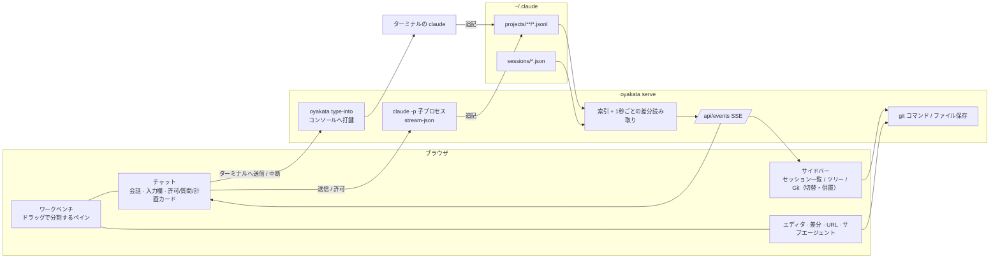

# OYAKATA（親方）

リポジトリをまたいで走っている Claude Code のセッションを、ブラウザ 1 枚で見渡し、指示を送り、変更を確かめて出荷するための司令塔です。

> A browser-based command post for Claude Code. It indexes every session under `~/.claude/projects`, groups them by repository, shows which ones are running right now, renders their output as proper HTML (Markdown, Mermaid diagrams, syntax-highlighted code), lets you start and drive sessions from the browser, and opens the repository's files, diffs and git operations next to the conversation. Single Rust binary, no runtime dependencies, nothing leaves your machine.

## できること

| 課題 | OYAKATA |
| --- | --- |
| 複数リポジトリで Claude を並行で動かすと、どれが何をしているか追えない | 稼働中セッションを上に固定し、セッションのあるリポジトリの配下に履歴を並べる。稼働中 / 待機中 / 許可待ち を 1 秒ごとに更新 |
| ターミナルでは長文・表・図が読みづらい | Markdown を描画。```` ```mermaid ```` は図に、コードはハイライト、表は表に |
| ツール呼び出しのログが文章を埋めてしまう | 「ログ: 畳む」で会話だけを表示。作業ログは「作業ログ N 件」の 1 行に折り畳まれ、実行中のものと下部の進行表示（何を何秒実行中か）で状況は見失わない |
| ブラウザから指示を送りたい | OYAKATA が起動したセッションには入力欄から送れる。権限の確認、AskUserQuestion の回答、計画（ExitPlanMode）の承認もチャット内で。ターミナルで動いているセッションにも、そのターミナルへ打ち込む形で送れる（Windows） |
| VS Code のターミナルの位置にチャットを置きたい | ペインをドラッグで自由に分割。チャット・エディタ・差分・URL・サブエージェントをタブとして並べ、配置は記憶される |
| Claude が変えたファイルをその場で直したい | CodeMirror のエディタで編集・保存（Ctrl+S、他で変更されていたら衝突を知らせる）。Claude が同じファイルを書き換えたら自動で読み直す |
| commit / push までブラウザで済ませたい | サイドバーの Git ビューに作業ツリーの変更、ログ、ブランチ。commit / push / pull は確認付き |
| サイドバーは一覧とツリーを行き来したい | セッション一覧 / ツリー / Git を切替、または「併置」で同時表示。開いているチャットのリポジトリにツリーが追従 |
| ワーカーが止まったことに気づかない | busy → idle、許可待ちになったらデスクトップ通知（任意） |
| 目に合う配色にしたい | ライト / ダーク / セピア / Solarized / Nord / Dracula / 高コントラスト とアクセント色、文字サイズ |

Claude Code の起動方法を変える必要はありません。閲覧は Claude Code が書き出すファイル（`projects/*/*.jsonl`、`sessions/*.json`）を読むだけです。

## インストール

```bash
cargo install --git https://github.com/ShintaroOba/oyakata
oyakata install        # /oyakata スキルを ~/.claude/skills/oyakata に置く
```

## 使い方

Claude Code の中から:

```
/oyakata
```

常駐プロセスが立ち上がり、ブラウザが今のセッションを開いた状態で起動します。スキルを読んだ Claude は以降、図を Mermaid で、比較を表で書くようになります。

ターミナルから:

```bash
oyakata                     # 起動（既に動いていればブラウザを開くだけ）
oyakata --focus <session>   # 指定セッションを開く
oyakata status              # 常駐の状態
oyakata stop                # 停止（OYAKATA が起動したセッションも終了。会話は残る）
oyakata serve               # フォアグラウンドで実行（ログを見たいとき）
```

### ターミナルとブラウザで同じセッションを使う

OYAKATA が持つセッションは、ブラウザのチャットからもターミナルからも入力できます。どちらから打っても同じ会話に入り、許可の確認や質問にもどちらからでも答えられます。

```bash
oyakata new "最初の指示"            # このフォルダで OYAKATA が持つセッションを始め、そのまま端末を接続
oyakata new --cwd ~/ghq/x "指示"   # フォルダを指定
oyakata attach <session-id>         # 端末を接続（/quit で端末だけ離脱、/stop でセッション終了）
oyakata attach --resume <id>        # 終了済みセッションを引き継いで再開（最初の指示を聞かれる）
oyakata sessions                    # OYAKATA が持っているセッションの一覧
```

ターミナルで `claude` を直接起動したセッションには、ブラウザの「ターミナルへ送信」でそのターミナルに打ち込めます（Windows。権限の確認や質問はターミナル側で答える）。ターミナル側で終了すると「引き継ぎ」で OYAKATA の持ち物にでき、以降は権限の確認も含めて両方から操作できます。

常駐を長く使うときは、Claude の中（`/oyakata`）からではなく、ターミナルで `oyakata` を実行して立ててください。Claude の中から立てた常駐は、その Claude セッションの終了に巻き込まれて止まることがあります。止まった場合でも会話は残り、ブラウザの「引き継いで送信」か `oyakata attach --resume` で続けられます。

既定では `http://127.0.0.1:4848` で待ち受けます。`--port`、`--bind`、`--claude-dir`、`--claude <claude のパス>`、`--repo-root <フォルダ>`（直下のリポジトリを一覧に加える。複数可）で変更できます。常駐のログは `~/.claude/oyakata.log` に出ます。

全セッションで Mermaid を優先させたい場合は、`~/.claude/CLAUDE.md` に次の 1 行を足してください（`oyakata install` でも案内されます）。

```
図は ```mermaid フェンスで書く（OYAKATA がブラウザで描画する）。ASCIIアートで図を描かない。
```

## 画面



### 画面の使い方

- セッションをクリックするとチャットが下のペインに開きます（VS Code のターミナルの位置）。ファイルを開くとその上にエディタが開きます。
- タブをドラッグして別のペインへ移す、またはペインの端（左右上下）に落として分割できます。サイドバーの行（セッション・ファイル・変更）もペインへ直接ドラッグできます。配置はブラウザに記憶され、設定の「ペイン配置を初期化」で戻せます。
- 「ログ: 畳む」にすると、ツール呼び出し・思考・コマンドの記録が「作業ログ N 件」の行に折り畳まれ、人間向けの会話だけが残ります。実行中はその行がスピナー付きで「実行中: Bash …」になり、入力欄の上に「何を何秒実行中か」の帯が出ます。

### 入力欄から送れるセッション

| セッション | 入力欄 |
| --- | --- |
| OYAKATA が起動したもの（「＋」、リポジトリの「新しいセッション」） | 送れる。権限の確認・質問もブラウザで答える。「中断」「セッションを終了」あり |
| 終了済み | 「引き継いで送信」で OYAKATA が `claude --resume` し、以後ここから会話できる |
| ターミナルで稼働中（Windows） | 「ターミナルへ送信」でそのターミナルに打ち込んで Enter を押す。作業中は「中断」で Esc を押す。確認待ちの間は送れない（Enter が既定の答えを選んでしまうため）。権限の確認・質問はターミナル側で答える |
| IDE 拡張・SDK で稼働中 | 送れない（打ち込む先のターミナルが無いため）。終了後に引き継げる |

OYAKATA が起動するセッションは `claude -p --input-format stream-json --output-format stream-json --permission-prompt-tool stdio` の子プロセスです。会話は通常どおり `~/.claude/projects` に書かれるので、表示は他のセッションと同じ仕組みです。モデル・権限モード・努力レベルは起動時に選べます。

| キー | 動作 |
| --- | --- |
| `/` | セッション検索 |
| `t` | ライト / ダーク切替 |
| `Ctrl+S` | エディタで保存 |
| `Enter` / `Shift+Enter` | 入力欄で送信 / 改行 |
| 中クリック | タブを閉じる |
| `Esc` | メニュー・ダイアログを閉じる |

## 仕組みと安全性

- `~/.claude/projects/<cwd>/<session>.jsonl` を起動時に 1 回読んでメタデータ（タイトル、cwd、往復数、トークン、編集ファイル、アーティファクト URL）を索引化し、以後はファイルサイズの増分だけを読み足します。表示中のセッションだけ本文をメモリに持ち、15 分見ていないものは落とします。
- `~/.claude/sessions/<pid>.json` が稼働中セッションの一覧です。pid が生きているものだけを「稼働中」と扱い、`status: waiting` は「許可待ち」として表示します。
- ターミナルで稼働中のセッションへの送信は、そのコンソールの入力バッファへキー入力を書き込みます（`AttachConsole` + `WriteConsoleInputW`）。Claude Code に外から入力を渡す公開手段が無いため、人が打つのと同じ経路を使っています。改行は Ctrl+J（Claude Code の「送らずに改行」）として打ち、Claude Code が送信前に確認を求めるゼロ幅文字などは先に取り除きます。打ち込む前に `sessions/<pid>.json` の `procStart` とプロセスの起動時刻を照合し、pid が別のプロセスに再利用されていたら打ちません。
- リポジトリは cwd から `.git` を探して判定します。ghq 形式のパスは `owner/name` で表示し、`ghq root` 配下のリポジトリはセッションが無くても一覧に出ます。
- Git 操作は `git` コマンドをそのまま呼びます。commit は選択したファイル（または `git add -A`）、push は上流が無ければ `-u origin HEAD`、pull は `--ff-only` です。ブランチ切替は入れていません。
- ファイル保存は読み込み時の更新時刻を添えて送り、ディスク上で変わっていれば 409 で止めて「上書き / 読み込み直す」を選ばせます。改行コードは元のファイルに合わせます。
- サーバーは 127.0.0.1 だけで待ち受け、`/api` へのクロスサイト要求は `Sec-Fetch-Site` で拒否、書き込み系はカスタムヘッダ必須（CORS プリフライトで止まる）にしています。
- 描画は [marked](https://github.com/markedjs/marked)・[DOMPurify](https://github.com/cure53/DOMPurify)・[highlight.js](https://highlightjs.org/)・[Mermaid](https://mermaid.js.org/)・[CodeMirror 5](https://codemirror.net/5/) をバイナリに同梱しています。オフラインで動きます。

## 開発

```bash
cargo test
cargo run -- serve --no-open
```

```
src/
  main.rs        CLI（起動・常駐・停止・スキル導入）
  server.rs      axum ルート、SSE、ファイル監視ループ、クロスサイト防御
  index.rs       セッション索引と増分更新、リポジトリ一覧
  transcript.rs  JSONL → 表示アイテム、編集ファイル・アーティファクトの抽出
  runner.rs      OYAKATA が起動する claude -p セッション（stream-json）
  console.rs     ターミナルで稼働中のセッションへの打鍵（Windows コンソール入力）
  client.rs      ターミナル側フロント（new / attach / sessions）
  gitops.rs      git status / tree / diff / log / commit / push / pull
  live.rs        稼働中セッション（pid 生存確認）
  repo.rs        cwd → リポジトリ名
web/
  index.html / style.css / icon.svg
  app.js         共通: API・テーマ・Markdown・トランスクリプト描画・イベントバス・設定
  workbench.js   ペインの分割ツリー、タブ、ドラッグ＆ドロップ、配置の保存
  chat.js        チャットペイン（会話・入力欄・許可/質問/計画カード・ログ折り畳み・進行表示）
  editors.js     CodeMirror エディタ、差分・コミット・URL・サブエージェントのビュー
  sidebar.js     セッション一覧 / ツリー / Git（commit・push・pull）
  vendor/        同梱ライブラリ（marked, DOMPurify, highlight.js, Mermaid, CodeMirror 5）
skills/oyakata/  /oyakata スキル
```

## ライセンス

MIT。同梱ライブラリのライセンスは `web/vendor/LICENSE.*` を参照してください。
